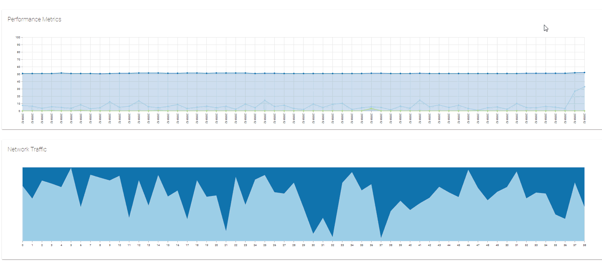

# Introduction

PowerShell Universal Dashboard allows for creation of web-based dashboards using PowerShell. The client and server side code for the dashboard is authored completely in PowerShell. Charts, monitors, tables and grids can easily be created with the cmdlets included with the module.The module is cross-platform and will run anywhere Windows PowerShell or PowerShell Core can run.

## Installation

**Enterprise Edition**


Enterprise Edition enables all the features of Community Edition with added charts, authorization and authentication. You can purchase a license [here](https://ironmansoftware.com/collections/powershell/products/powershell-universal-dashboard).


`Install-Module UniversalDashboard -AcceptLicense`

**Community Edition**


Universal Dashboard also features a free Community Edition. This edition is [open-source](https://github.com/ironmansoftware/universal-dashboard), [LGPL licensed](https://github.com/ironmansoftware/universal-dashboard/blob/master/LICENSE) and [available for free](https://www.powershellgallery.com/packages/UniversalDashboard.Community). It contains a subset of features of the Enterprise Edition. To install this version, use the following command line.


`Install-Module UniversalDashboard.Community -AcceptLicense`

For a full list of the differences between Community and Enterprise, visit the [Feature Comparison](feature-comparison.md) page.

