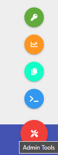
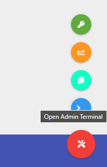
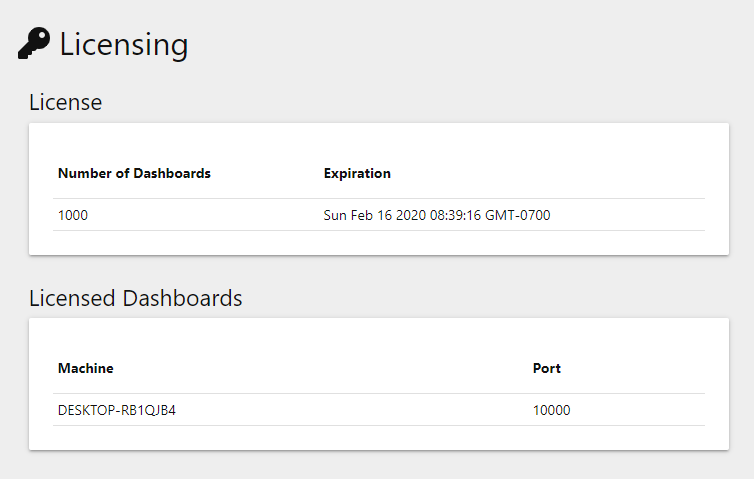

# Admin Mode


Universal Dashboard is now a part of PowerShell Universal. This documentation is for reference to the v2 version of Universal Dashboard and is no longer maintained. PowerShell Universal Documentation can be found [here](https://docs.ironmansoftware.com).


## Admin Mode

### Admin Mode


This page does not apply to Universal Dashboard Community Edition


Admin mode turns on various features within Universal Dashboard to enable better management and administration of the platform. These features include the following.

* In-Browser Terminal
* Clipboard Copy of Grid Layout 
* License Information Page
* Diagnostics Page 

### Enabling AdminMode

Admin Mode can be enabled on the `Start-UDDashboard` cmdlet by using the `-AdminMode` switch.

```text
Start-UDDashboard -Port 10000 -Dashboard $Dashboard -AdminMode
```

Once enabled, any user visiting the site will have access to the admin mode controls by using the fab button located in the bottom right of the web site.



### Admin Terminal

The Admin Terminal is an in-browser terminal that you can use to execute PowerShell commands within the Universal Dashboard environment. Universal Dashboard runspaces provide special variables at runtime that aren't typically available in the default runspace on the command line. Using the Admin Terminal is a good way to debug dashboards that are up and running.

You can open the Admin Terminal by clicking the terminal icon within the Admin Tools.



The terminal will open within a modal. You can type commands within the text field and it will issue them within the UD runspaces. Command completetion is not available within the terminal. Be careful when exposing the terminal to any user as there is no limit to what commands they can run.


### Copying Grid Layout

See the [Grid Layout documentation](components/grid-layout.md) to learn how to copy the layout.

### Diagnostics

The diagnostics page can be accessed by clicking the chart button within the Admin Tools.


The diagnostics pages shows lots of information about the currently running dashboard. This includes the number of sessions, endpoints, runspaces and memory usage. There is additional information about the variables currently in the cache, the endpoints that have been defined and registered with UD as well as any running sessions that you have within your dashboard.

#### TODO PICTURE

### Licensing

The licensing page contains information about the currently installed license. This includes when the license will expire and how many dashboards the license is valid for.



### Authorization

If you want to enable admin mode on your production systems, you will want to employ [authorization policies](security/authorization/claims-based.md) for the feature. You can select which authorization policy enforces the ability to use admin mode by defining the `-AdminModeAuthorizationPolicy` parameter on `Start-UDDashboard`. Only users that meet this authorization policy will be granted access to Admin Mode.

```text
$AuthorizationPolicy = New-UDAuthorizationPolicy -Name 'Admin' -Endpoint {
    param($User)

    $User.Identity.Name -eq 'Admin'
}

$Dashboard = New-UDDashboard -Title "Admin" -Content {} -LoginPage (
    New-UDLoginPage -AuthenticationMethod $Methods -AuthorizationPolicy $AuthorizationPolicy
)

Start-UDDashboard -Port 10000 -Dashboard $Dashboard -AdminMode -AdminModeAuthorizationPolicy 'Admin'
```

