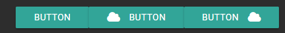

# Button


Universal Dashboard is now a part of PowerShell Universal. This documentation is for reference to the v2 version of Universal Dashboard and is no longer maintained. PowerShell Universal Documentation can be found [here](https://docs.ironmansoftware.com).


## Button

Buttons are used for basic interactions from users. You can add event handlers to buttons to perform actions when they are clicked.

### Raised



```text
New-UDButton -Text "Button" 
New-UDButton -Text "Button" -Icon cloud -IconAlignment left
New-UDButton -Text "Button" -Icon cloud -IconAlignment right
```

### Floating


```text
New-UDButton -Floating -Icon plus
```

### OnClick Event Handler


See [Event Handler Endpoints ](https://docs.universaldashboard.io/endpoints/event-handler-endpoints)for more information about how event handlers work.


A ScriptBlock that is invoked when the button is clicked.

```text
New-UDButton -Text "Click me!" -OnClick {
    Show-UDToast -Message "Clicked!"
}
```

### Passing Variables to a Button OnClick Handler

```text
$MyVariable = "Some Text"
New-UDButton -Text "Click me!" -OnClick (
    New-UDEndpoint -Endpoint {
        Show-UDToast -Message $ArgumentList[0]
    } -ArgumentList @($MyVariable)
)
```

