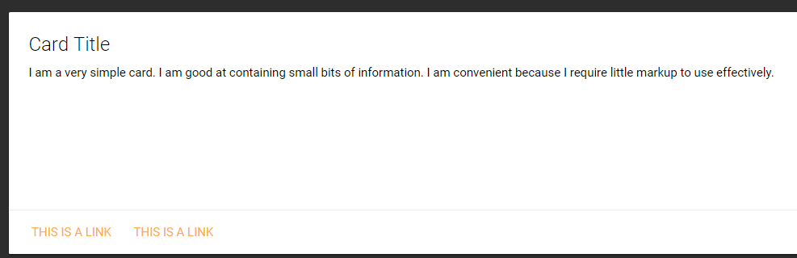

# Card

Cards are a convenient means of displaying content composed of different types of objects. They're also well-suited for presenting similar objects whose size or supported actions can vary considerably, like photos with captions of variable length.

## Basic Cards



```text
New-UDCard -Title 'Card Title' -Content {
    New-UDParagraph -Text 'I am a very simple card. I am good at containing small bits of information. I am convenient because I require little markup to use effectively.'
} -Links @(
    New-UDLink -Text 'This is a link' -Url '#!'
    New-UDLink -Text 'This is a link' -Url '#!'
) -Size 'small'
```

