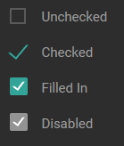

# Checkbox

## Properties



```text
New-UDCheckbox -Label Unchecked
New-UDCheckbox -Label Checked -Checked
New-UDCheckbox -Label 'Filled In' -Checked -FilledIn
New-UDCheckbox -Label 'Disabled' -Checked -FilledIn -Disabled
```

## OnChange Handler


See [Event Handler Endpoints ](https://docs.universaldashboard.io/endpoints/event-handler-endpoints)for more information about how event handlers work.


To handle changes in the checkbox value, you can add a script block or `UDEndpoint` to the `-OnChange` parameter.

```text
New-UDElement -Id "CheckboxState" -Tag "span" 
New-UDCheckbox -Id CheckBox -Label "Check me" -OnChange {
    $Element = Get-UDElement -Id CheckBox
    Set-UDElement -Id "CheckboxState" -Content $Element.Attributes["checked"]
}
```

