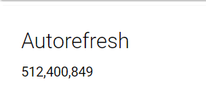

# Counter

Counters allow you to show numbers in a card with icons and formatting. 

## Creating a basic counter

```text
New-UDCounter -Title "Basic" -Endpoint {
    1
}
```


## Auto refreshing a counter

```text
  New-UDCounter -Title "Autorefresh" -AutoRefresh -RefreshInterval 1 -Endpoint {
      Get-Random 
  }
```



## Formatting numbers in a counter

UDCards use [NumeralJS ](http://numeraljs.com/)to format numbers. You can use any format you find on the NumeralJS [format documentation](http://numeraljs.com/#format).

```text
 New-UDCounter -Title "Formatting" -Format '$0,0.00' -Endpoint {
     Get-Random 
 }
```


## Showing an icon

```text
New-UDCounter -Title "Icon" -Format '$0,0.00' -Endpoint {
    Get-Random 
} -Icon dollar
```


