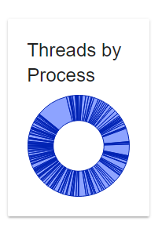
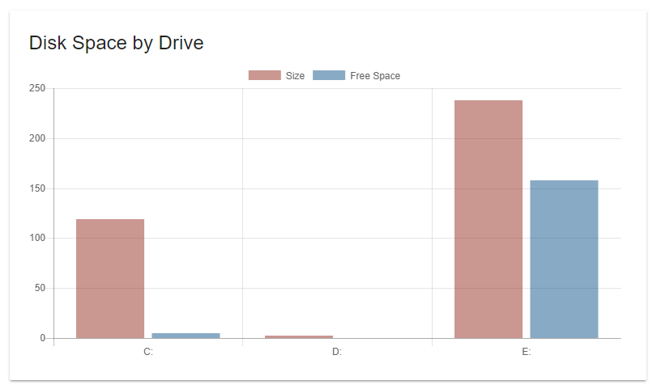

# Charts

Charts can be created with the New-UDChart cmdlet. Charts can be either bar, line, doughnut or pie. Chart data is supplied via a server-side PowerShell snippet. Charts can be extensively customized. This includes colors, borders and any option that the [ChartJS](http://www.chartjs.org/) library provides.

## Creating a basic chart

A basic chart can be created by specifying the Title, Type and Endpoint.

```text
New-UDChart -Title "Threads by Process" -Type Doughnut -RefreshInterval 5 -Endpoint {  
    Get-Process | ForEach-Object { [PSCustomObject]@{ Name = $_.Name; Threads = $_.Threads.Count } } | Out-UDChartData -DataProperty "Threads" -LabelProperty "Name"  
} -Options @{  
     legend = @{  
         display = $false  
     }  
   }
```

The above script would result in the below chart.



The data in the chart is the number of threads per process name. Chart data is returned from an Endpoint using the Out-UDChartData cmdlet. It formats the chart data as JSON and in a format that the client-side JavaScript understands. It's required to supply a DataProperty and a LabelProperty. The DataProperty is the Y-axis in a line or bar chart and the LabelProperty is the X-axis.

Additional options can be supplied to the chart control via the Options parameter. It should be a hashtable with [ChartJS options](http://www.chartjs.org/docs/latest/charts/line.html#disable-animations) for the specified chart. Charts can also AutoRefresh at a specified interval. The RefreshInterval is the number of seconds between refreshes.

## Chart Colors

Chart colors can be configured using the options defined on the `Out-UDChartData` cmdlet. You can specify colors for the background, border, hover background and hover border.

```text
New-UDChart -Type Bar -Endpoint {
    Get-Process | 
        Sort-Object -Descending -Property PM | 
        Select-Object -First 10 | 
        Out-UDChartData -DataProperty PM -LabelProperty Name -BackgroundColor '#FF530D' -BorderColor 'black' -HoverBackgroundColor '#FF9F0D'
}
```


## Creating charts with multiple datasets

To create charts with multiple datasets, use the Out-UDChartData parameter set that accepts an array of datasets created by New-UDChartData set. Each dataset selects a different dimension of data from the supplied object. An example would be selecting the Total Size and Free Space from the disk drives on a computer.

```text
New-UdChart -Title "Disk Space by Drive" -Type Bar -AutoRefresh -Endpoint {
  Get-CimInstance -ClassName Win32_LogicalDisk | ForEach-Object {
          [PSCustomObject]@{ DeviceId = $_.DeviceID;
                        Size = [Math]::Round($_.Size / 1GB, 2);
                        FreeSpace = [Math]::Round($_.FreeSpace / 1GB, 2); } } | Out-UDChartData -LabelProperty "DeviceID" -Dataset @(
       New-UdChartDataset -DataProperty "Size" -Label "Size" -BackgroundColor "#80962F23" -HoverBackgroundColor "#80962F23"
       New-UdChartDataset -DataProperty "FreeSpace" -Label "Free Space" -BackgroundColor "#8014558C" -HoverBackgroundColor "#8014558C"
   )
 }
}
```

The New-UDChartDataset cmdlet expects the DataProperty and Label of the dataset you are creating. You can easily select colors and border styles for the chart. The above example would produce the following chart.



## Stacked Bar Charts

To create a stacked bar chart, use the `-Options` parameter and specify the options hashtable below.

```text
New-UDChart -Type Bar -Endpoint {
    Get-CimInstance -ClassName Win32_LogicalDisk | ForEach-Object {
        [PSCustomObject]@{ DeviceId = $_.DeviceID;
                      Size = [Math]::Round($_.Size / 1GB, 2);
                      FreeSpace = [Math]::Round($_.FreeSpace / 1GB, 2); } } | Out-UDChartData -LabelProperty "DeviceID" -Dataset @(
     New-UdChartDataset -DataProperty "Size" -Label "Size" -BackgroundColor "#80962F23" -HoverBackgroundColor "#80962F23"
     New-UdChartDataset -DataProperty "FreeSpace" -Label "Free Space" -BackgroundColor "#8014558C" -HoverBackgroundColor "#8014558C"
 )
} -Labels @("Process Memory") -Options @{
    scales = @{
        xAxes = @(
            @{
                stacked = $true
            }
        )
        yAxes = @(
            @{
                stacked = $true
            }
        )
    }
}
```


## Chart with multiple datasets with different chart types

You can set the `type` property of the a dataset created with `New-UDChartDataset` to adjust the chart type per dataset.

```text
 New-UdChart -Title "Virtual Memory Size" -Type Bar -Endpoint {
      Get-Process | Get-Random -Count 10 |  Out-UDChartData -LabelProperty "Name" -Dataset @(
           $ds1 = New-UdChartDataset -DataProperty "VirtualMemorySize" -Label "Size" -BackgroundColor "#80962F23" -HoverBackgroundColor "#80962F23" 
           $ds1.type = 'bar'
           $ds2 = New-UdChartDataset -DataProperty "PeakVirtualMemorySize" -Label "Free Space" -BackgroundColor "#8014558C" -HoverBackgroundColor "#8014558C"
           $ds2.type = 'line'
           $ds1
           $ds2
       )
}
```


