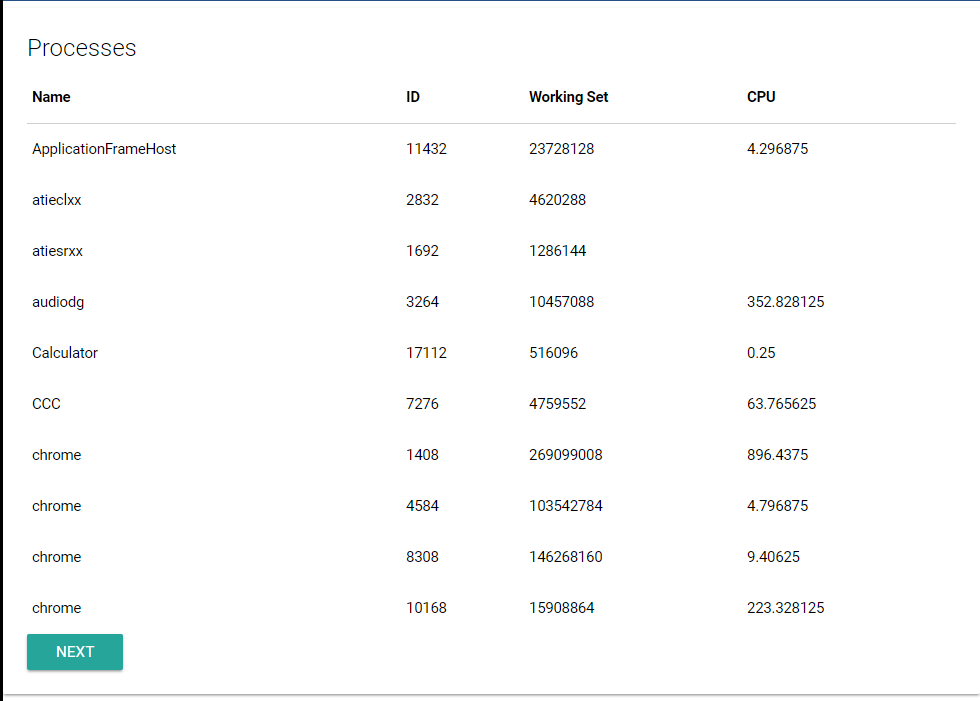

# Grids

Grids output data similar to tables but allow for paging and sorting the data in the grid. Grids are produced using the [Griddle ](https://griddlegriddle.github.io/Griddle/docs/)library. Grids are created with the New-UDGrid cmdlet and data for the grid is output using the Out-UDGridData cmdlet.

The below script selects the Name, Id, WorkingSet and CPU of ProcessInfo objects returned by Get-Process. The gird auto refreshes every minute.

```text
New-UdGrid -Title "Processes" -Headers @("Name", "ID", "Working Set", "CPU") -Properties @("Name", "Id", "WorkingSet", "CPU") -AutoRefresh -RefreshInterval 60 -Endpoint {
       Get-Process | Select Name,ID,WorkingSet,CPU | Out-UDGridData
}
```

The above script produces the following grid.



## Formatting DateTimes on the client

If your data set includes a System.DateTime object as one of the properties, the UDGrid component will format the DateTime is the user's browsers local time zone settings. It uses [MomentJS](https://momentjs.com/docs/#/displaying/) to format the date time into a readable string. By default, it uses the `lll` format which yields a date time such as `Sep 4, 1986 8:30 PM`. You can customize the date time format by specifying the `-DateTimeFormat` on `New-UDGrid`.

```text
New-UdGrid -Title "Files" -Headers @("Name", "Last Write Time") -Properties @("Name", "LastWriteTime") -AutoRefresh -RefreshInterval 60 -Endpoint {
       Get-ChildItem C:\temp |  | Out-UDGridData
} -DateTimeFormat 'LLLL'
```

## Including links in columns

In addition to passing raw data down to a grid, you can also include links. Use the `New-UDLink` cmdlet to add links into columns.

```text
$Data = @(
    [PSCustomObject]@{Animal="Frog";Order="Anura";Article=(New-UDLink -Text "Wikipedia" -Url "https://en.wikipedia.org/wiki/Frog")}
    [PSCustomObject]@{Animal="Tiger";Order="Carnivora";Article=(New-UDLink -Text "Wikipedia" -Url "https://en.wikipedia.org/wiki/Tiger")}
    [PSCustomObject]@{Animal="Bat";Order="Chiroptera";Article=(New-UDLink -Text "Wikipedia" -Url "https://en.wikipedia.org/wiki/Bat")}
    [PSCustomObject]@{Animal="Fox";Order="Carnivora";Article=(New-UDLink -Text "Wikipedia" -Url "https://en.wikipedia.org/wiki/Fox")}
)

$Dashboard = New-UDDashboard -Title "Grids - Custom Columns" -Content {
    New-UDGrid -Title "Animals" -Headers @("Animal", "Order", "Wikipedia") -Properties @("Animal", "Order", "Article") -Endpoint {
        $Data | Out-UDGridData
    }
}
```

## Server Side Processing

When the `-ServerSideProcessing` parameter is specified, it calls the `Endpoint` script block to perform the paging, filtering and sorting. To allow for this, there are several variables that are provided when the `Endpoint` script block is executed.

| Name | Description | Type |
| :--- | :--- | :--- |
| $Skip | The number of records to skip. | integer |
| $Take | The number of records to take. | integer |
| $SortColumn | The name of the property or column to sort on. | string |
| $SortAscending | Whether to sort ascending, otherwise descending. | string |
| $FilterText | The text to filter items or records by. | string |

