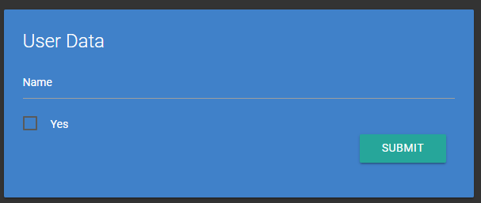
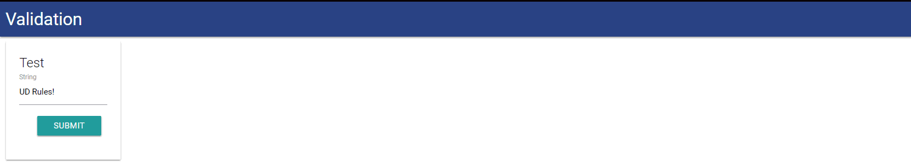
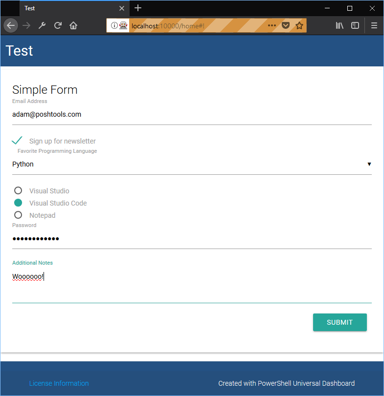

# Inputs

New-UDInput allows you to create cards on the dashboard that take user input. The input can then be processed on the server and an action can be presented to the user on the dashboard.

## Creating a new input

To create a new input, use New-UDInput and specify the Endpoint parameter. The input on the form will automatically be generated based on the Param block within the Endpoint script block.

```text
New-UDInput -Title "User Data" -Endpoint {
      param($Name, [bool]$Yes)

    if ($Yes) {
        New-UDInputAction -Toast "Yes, $Name"
    } else {
        New-UDInputAction -Toast "No, $Name"
    }
}
```

The above input would produce the following card.



New-UDInput currently generates textboxes and checkboxes. You can take any action you like within the Endpoint block. For example, you could look for a module in the PowerShell Gallery.

```text
New-UDInput -Title "Module Info Locator" -Endpoint {
    param($ModuleName) 

    # Get a module from the gallery
    $Module = Find-Module $ModuleName
}
```

## Validating Input

You can validate input by using any of the PowerShell [validation attributes](https://docs.microsoft.com/en-us/powershell/developer/cmdlet/validating-parameter-input). To enforce client-side validation, use the `-Validation` parameter of `New-UDInput` and specify a param block with valiation attributes on the parameters in your block.

```text
 New-UDInput -Title 'Test' -Endpoint {
    param(
        [Parameter(Mandatory)]
        [UniversalDashboard.ValidationErrorMessage("The email address you entered is invalid.")]
        [ValidatePattern('.*Rules.*')]
        $EmailAddress,
        [Parameter(Mandatory)]
        $SomeOtherField
    )

} -Validate
```

The `UniversalDashboard.ValidationErrorMessage` is used to provide a custom error message when the default error message is not user friendly enough.



## Returning Actions to the User

There are three actions you can return to the user. They include sending a toast message, redirecting to a URL and replacing the Input card's content with different content.

### Sending a toast message

To send a toast message, simply call New-UDInputAction with the -Toast parameter and pass in text you would like to toast the user with.

```text
New-UDInput -Title "Find module version" -Endpoint {
    param($ModuleName) 

    # Get a module from the gallery
    $Module = Find-Module $ModuleName

    New-UDInputAction -Toast $Module.Version
}
```

### Redirecting to a URL

To redirect to a URL, use the RedirectUrl parameter of New-UDInputAction.

```text
New-UDInput -Title "Find module version" -Endpoint {
    param($ModuleName) 

    # Get a module from the gallery
    $Module = Find-Module $ModuleName

    New-UDInputAction -RedirectUrl $Module.ProjectUri
}
```

If you provide a relative path, you can redirect the user to a dynamic page.

```text
New-UDInput -Title "Find module version" -Endpoint {
    param($ModuleName) 

    # Get a module from the gallery
    $Module = Find-Module $ModuleName

    New-UDInputAction -RedirectUrl "/module/$ModuleName"
}
```

### Replacing the contents of the input card

You can replace the contents of the input card with different content by using the Content parameter and returning one or more components.

```text
New-UDInput -Title "Module Info Locator" -Endpoint {
    param($ModuleName) 

    # Get a module from the gallery
    $Module = Find-Module $ModuleName

    # Output a new card based on that info
    New-UDInputAction -Content @(
        New-UDCard -Title "$ModuleName - $($Module.Version)" -Text $Module.Description
    )
}
```

## Custom Inputs



In order to further customize a UDInput, you can use the Content parameter of the New-UDInput cmdlet. This parameter lets you customize the input fields more granularly than with an Endpoint parameter alone. When using the Content parameter, the Param block in the Endpoint does not define the fields in the UDInput component. You instead will use New-UDInputField within the Content parameter's script block to define the fields you would like to use.

Supported controls include:

* Textboxes
* Checkboxes
* Select
* Switches
* Textareas
* Radio buttons

```text
 New-UDInput -Title "Simple Form" -Id "Form" -Content {
    New-UDInputField -Type 'textbox' -Name 'Email' -Placeholder 'Email Address'
    New-UDInputField -Type 'checkbox' -Name 'Newsletter' -Placeholder 'Sign up for newsletter'
    New-UDInputField -Type 'select' -Name 'FavoriteLanguage' -Placeholder 'Favorite Programming Language' -Values @("PowerShell", "Python", "C#")
    New-UDInputField -Type 'radioButtons' -Name 'FavoriteEditor' -Placeholder @("Visual Studio", "Visual Studio Code", "Notepad") -Values @("VS", "VSC", "NP")
    New-UDInputField -Type 'password' -Name 'password' -Placeholder 'Password'
    New-UDInputField -Type 'textarea' -Name 'notes' -Placeholder 'Additional Notes'
} -Endpoint {
    param($Email, $Newsletter, $FavoriteLanguage, $FavoriteEditor, $password, $notes)
}
```

New-UDInputField requires the Name parameter. This is used to specify the name of the parameter that will be passed into the Endpoint for New-UDInput. For example, in the above script, when the user enters their email address into the first text box, the value of that will be passed into $Email when they click the submit button.

The endpoint works the same as any other input and you can return New-UDInputActions from it.

