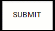
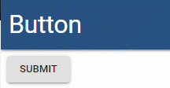

# Button

## Contained

```text
New-UDMuButton -Text 'Submit' -Variant contained
```


## Flat

```text
New-UDMuButton -Text 'Submit' -Variant flat
```



## Outlined

```text
New-UDMuButton -Text 'Submit' -Variant outlined
```


## Icons

```text
New-UDMuButton -Text 'Buy' -Variant contained -Icon (New-UDMuIcon -Icon bitcoin -Size '4x')
```


## Full Width

```text
New-UDMuButton -Text 'Submit' -Variant contained -FullWidth
```


## OnClick Handler

```text
New-UDMuButton -Text 'Submit' -Variant contained -OnClick { 
    Show-UDToast -Message "You clicked me!" -Position topLeft
}
```



## Custom Colors

```text
New-UDMuButton -Text 'Submit' -Variant contained -Style @{ backgroundColor = "blue"; color = "white" }
```


