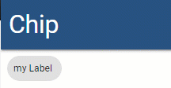
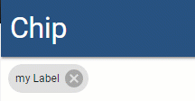

# Chip

## Label

```text
New-UDMuChip -Label "my Label" -Id "chip"
```


## Icon

```text
$Icon = New-UDMuIcon -Icon 'user' -Size sm -Style @{color = '#fff'}
New-UDMuChip -Label "Demo User" -Icon $Icon
```


## OnClick

```text
 New-UDMuChip -Label "my Label" -OnClick {
     Show-UDToast 'Clicked' -Position topLeft
 }
```



## OnDelete

```text
 New-UDMuChip -Label "my Label" -OnDelete {
     Show-UDToast 'Deleted' -Position topLeft
 }
```



