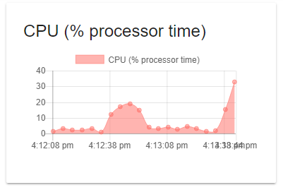

# Monitors

Monitors are special charts that track data over time. An example of a monitor may be the CPU or memory usage on a machine. Unlike a chart, the Endpoint does not return an entire dataset for mapping. Instead it returns a scalar value that can be charted over time. Refresh intervals and the number of data points to keep are configurable. Data isn't persisted and refreshing a dashboard will begin plotting data from the time it was loaded.

## Creating a Monitor

Monitors are created using the New-UDMonitor cmdlet. Some of the same options as the New-UDChart cmdlet are available on New-Monitor. It allows for Bar and Line chart. The below example script selects the current % processor time on the local machine and outputs the data using Out-UDMonitorData.

```text
New-UdMonitor -Title "CPU (% processor time)" -Type Line -DataPointHistory 20 -RefreshInterval 5 -ChartBackgroundColor '#80FF6B63' -ChartBorderColor '#FFFF6B63'  -Endpoint {
     Get-Counter '\Processor(_Total)\% Processor Time' -ErrorAction SilentlyContinue | Select-Object -ExpandProperty CounterSamples | Select-Object -ExpandProperty CookedValue | Out-UDMonitorData
}
```

The script produces a control like the chart below.



