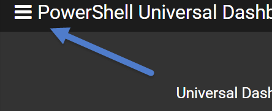

# Pages

## Creating a dashboard with multiple pages

Dashboards can be broken down into multiple pages by using the New-UDPage cmdlet along with New-UDDashboard's Pages parameter. Each page can have a name and icon. The name provides both the name of the page in the navigation bar but also the URL for the page. The icon is displayed in the navigation bar along side the name.

An example multi-page dashboard would be as follows.

```text
$Page1 = New-UDPage -Name "Home" -Icon home -Content { New-UDCard }    
$Page2 = New-UDPage -Name "Links" -Icon link -Content { New-UDCard }    
New-UDDashboard -Pages @($Page1, $Page2)
```

## Navigating Between Pages

Once you have created your multi-page dashboard, you will now have a hamburger menu icon available in the bottom left corner of the dashboard. Click the icon will pop out the dashboard navigation pane. Clicking the links will take you to the different pages of your dashboard.




## Automatically Cycling Through Pages

Since dashboards may often be used for display purposes only, you can also enable auto-cycling of pages. On New-UDDashboard, specify the CyclePages and CyclePagesInterval parameters. CyclePagesInterval is the number of seconds to wait while displaying a dashboard page.

## Dynamic Pages

Dynamic pages are created by specifying a page URL and an Endpoint. Unlike static pages, a dynamic page is generated every time the URL is hit. This means there is a slight performance penalty to a dynamic page but unlimited options of what you can do on that page. To create a basic dynamic page, use New-UDPage and the URL and Endpoint parameters.

This page can be reach by visiting: [http://localhost/myPage/16](http://localhost/myPage/16) or any other number.

```text
New-UDPage -Url "/myPage/:number" -Endpoint {
    param($number)

    New-UDCard -Title "Page $number" -Id "PageCard"
}
```

Any portion of the URL that is prefixed with a colon \(:\), is considered a variable. The value will be passed into the Endpoint script block via the param arguments. This means you can have multiple variables in a route.

```text
New-UDPage -Url "/myPage/:number/:number2" -Endpoint {
    param($number, $number2)

    New-UDCard -Title "Page $number $number2" -Id "PageCard"
}
```

You must have a single static page to serve as a home page or visiting you dashboard's home page will simply display a warning message.

New-UDInputAction can be used to redirect to a dynamic page. See the documentation on [Inputs ](https://github.com/adamdriscoll/universal-dashboard-documentation/tree/89087727c84b163ffad4ab000df1b69ba54f36bc/powershell-pro-tools-documentation/inputs.md)for more information.

