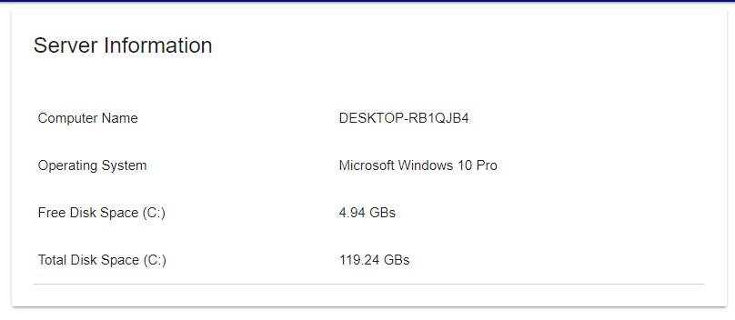

# Tables


Universal Dashboard is now a part of PowerShell Universal. This documentation is for reference to the v2 version of Universal Dashboard and is no longer maintained. PowerShell Universal Documentation can be found [here](https://docs.ironmansoftware.com).


## Tables

Tables are simple controls that output data in an HTML table. Tables are created with the New-UDTable cmdlet and endpoint data is output using the Out-UDTableData cmdlet.

The script below creates a new table with some information about the local machine. The first column in the table is the Name of the items in the hashtable and the second column is the Value of the items in the hashtable.

```text
New-UDTable -Title "Server Information" -Headers @(" ", " ") -Endpoint {
    @{
       'Computer Name' = $env:COMPUTERNAME
       'Operating System' = (Get-CimInstance -ClassName Win32_OperatingSystem).Caption
       'Total Disk Space (C:)' = (Get-CimInstance -ClassName Win32_LogicalDisk -Filter "DeviceID='C:'").Size / 1GB | ForEach-Object { "$([Math]::Round($_, 2)) GBs " }
       'Free Disk Space (C:)' = (Get-CimInstance -ClassName Win32_LogicalDisk -Filter "DeviceID='C:'").FreeSpace / 1GB | ForEach-Object { "$([Math]::Round($_, 2)) GBs " }
     }.GetEnumerator() | Out-UDTableData -Property @("Name", "Value")
}
```

The above script produces the following HTML control.



