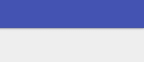

# Toasts

`Show-UDToast` is used to show toasts to the end user. You can show a toast message from any endpoint \(dynamic\) component. You cannot show toasts from Scheduled Endpoints. 

## Showing a Basic Toast

```text
 New-UDButton -Text "Show Toast" -OnClick {
    Show-UDToast -Message "Hello"
 }
```


## Customizing the Colors

```text
New-UDButton -Text "Show Toast" -OnClick {
  Show-UDToast -Message "Hello" -BackgroundColor red -MessageColor white
}
```


## Toast Title

```text
New-UDButton -Text "Show Toast" -OnClick {
    Show-UDToast -Message "World" -Title "Hello" 
}
```


## Changing Positions

```text
New-UDButton -Text "Show Toast" -OnClick {
   Show-UDToast -Message "Hello" -Position topLeft
}
```


## Balloon Toast

```text
New-UDButton -Text "Show Toast" -OnClick {
   Show-UDToast -Message "Hello" -Balloon
}
```


## Duration of Toasts

```text
New-UDButton -Text "Show Toast" -OnClick {
   Show-UDToast -Message "Hello" -Duration 30000
}
```


## Transitions

```text
New-UDButton -Text "Show Toast" -OnClick {
   Show-UDToast -Message "Hello" -TransitionIn bounceInRight
}
```



