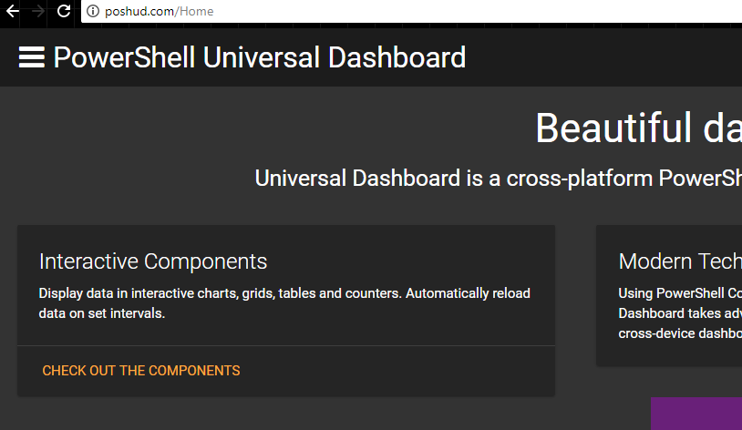
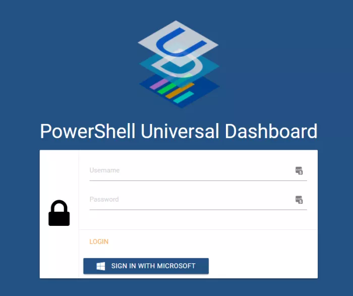

# Concepts

Universal Dashboard is a PowerShell Module to create interactive web-based dashboards and REST APIs using only PowerShell. You can define the layout of the client user interface as well as the server-side PowerShell scripts to execute when loading data into your dashboard. Since everything is authored in PowerShell, you have access to all the features and modules that PowerShell provides.

## Dashboards



Dashboards are the top-level element in Universal Dashboard. A dashboard is composed of one or more pages with any number of components on those pages. Dashboards behave as a stand-alone web server and run on the port of your choosing. You can run multiple dashboards per server as long as they listen on different ports.

## Components


Dashboards are made up of components. There are components for formatting, charts, input and more. Each component may translates to a different aspect of the client webpage as well as the server side endpoints. You can define properties like colors and text that are static as well as data for charts that is loaded dynamically on an interval.

## [Endpoints](endpoints/)

```text
New-UDMonitor -Title "Downloads per second" -Type Line -Endpoint {
    Get-Random -Minimum 0 -Maximum 10 | Out-UDMonitorData
}
```

Endpoints are PowerShell script blocks that run within the Universal Dashboard server. Components that support server-side data have Endpoint properties that are executed when data is requested by the client. Endpoints are hosted as part of an isolated runspace pool and not in the same execution environment as the PowerShell session that started the dashboard. 

## Pages


Dashboards can have multiple pages that can be viewed via links, the menu, URLs or through dynamic input. There are both static and dynamic pages. Static pages display content that has been defined in the dashboard. Dynamic pages are created whenever they are requested and have access to segments of the URL that may be dynamically defined.

## Login Page


Not available in Community Edition.




Authentication and Authorization is defined via login page configuration. Universal Dashboard supports popular OData provides such as Microsoft, Google and Twitter as well as forms-based authentication. Forms authentication provides a script block with the username and password and the dashboard developer can use it to authenticate against whatever mechanism they wish.

## REST APIs

Since Universal Dashboard is just a web server, it can also operate as a REST API. The `New-UDEndpoint` cmdlet can be paired with either `Start-UDDashboard` or `Start-UDRestApi` to define a RESTful service you can call from any HTTP compatible service. When using `Start-UDDashboard`, you will have both a website and a REST service running on the same port.

