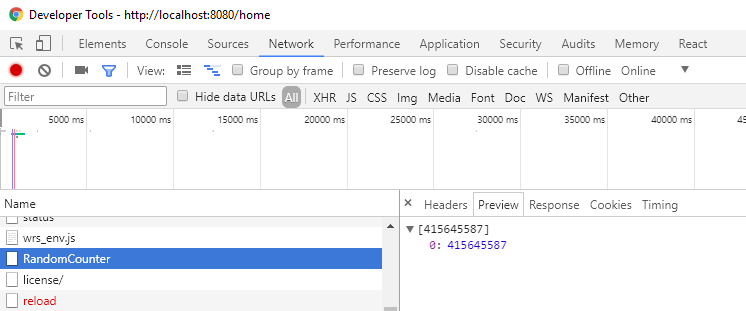
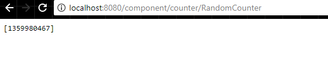

# Debugging

When developing a dashboard it may become necessary to debug an endpoint. Endpoints are run within the Universal Dashboard server in a different runspace than the runspace you used to start the dashboard. Because of this, it can become difficult to determine an error that may be preventing data from appearing in your dashboard. Terminating errors should result in the UD card displaying the error message but non-terminating errors or unexpected behavior may not be reflected at all in the user interface.

## Debugging Endpoints

Since Endpoints run in a different runspace than the runspace used to start the dashboard, it can be difficult to see what is going on. The best way to debug endpoints is to include a call to `Wait-Debugger` within your endpoint.

When PowerShell hits the `Wait-Debugger` call it will block the endpoint from executing and the runspace will be in a "InBreakpoint" state.

For example, if I had a UDCounter that I wanted to debug, I could simply add a `Wait-Debugger` call to the Endpoint script block.

```text
New-UDCounter -Title "My Counter" -Id "Counter" -TextAlignment Left -TextSize Small -Icon user -Endpoint {
    Wait-Debugger
    1000
}
```

When I start my dashboard, I wouldn't see the value of 1000 shown in the browser. The client side AJAX call would be blocked, waiting for the PowerShell to continue executing.

If I ran a `Get-Runspace` call, I would see that I have a couple runspaces and one of the is "InBreakpoint". This is the runspace that is executing for my counter's endpoint.

```text
 Id Name            ComputerName    Type          State         Availability
 -- ----            ------------    ----          -----         ------------
  1 Runspace1       localhost       Local         Opened        Busy
 12 Runspace12      localhost       Local         Opened        InBreakpoint
```

### **Debugging in VS Code**

To debug an endpoint in VS Code, you can use the PowerShell Attach to Host Process debug configuration. From the debug pane, create a new debug configuration if you do not have one. 


Once you have a launch.json file created, you can then setup the configuration to connect to the remote runspace that is currently InBreakpoint. You will need the process ID of the PowerShell process running UD. You can find this by evaluating the `$PID` variable in the PowerShell console. 

The next step is to set the runspaceId to the runspace that is currently InBreakpoint. In the `launch.json` file, edit the PowerShell Attach to Host Process configuration's runspaceId property to contain the runspace ID listed in the console. 


After this is done, press F5 to start a debugging session. A select box will allow you to pick the PowerShell process. Select the process running UD. 


After selecting the process, VS Code will break into the endpoint's script block. 


From here, you'll be able to step through the script, evaluate variables and run any command in the integrated terminal from within the endpoint's runspace. 


**Attaching via the Console**

To debug what is going on within this endpoint, I can use the `Debug-Runspace` cmdlet. If I specify the Id of the runspace, it will enter into the debugger for that runspace.

```text
PS C:\Users\adamr> Debug-Runspace -Id 12
Debugging Runspace: Runspace12
To end the debugging session type the 'Detach' command at the debugger prompt, or type 'Ctrl+C' otherwise.

Entering debug mode. Use h or ? for help.

At line:3 char:17
+                 1000
+                 ~~~~
```

I can now run standard debugging operations like stepping over and into as well as running other cmdlets and viewing variable values within that runspace. Entering `c` will allow the endpoint to continue.

## Debugging the return value of an endpoint from the browser

Sometimes the serialization of an object may not go as expected. To see what is returned by the server to the web browser, you can specify the endpoint URL in the browser address bar or use the F12 developer tools in your browser.

### Finding the correct URL

Assuming we have a UDCounter, we can determine the result of that counter by finding the request in the browser developer tools.

The easiest way to find a URL is to ensure that is has an easy to find ID. If the ID isn't specified then the component's ID is a randomly generated GUID. It will remain the same for the duration of the execution of the UDDashboard but recreating a dashboard via New-UDDashboard will regenerate this GUID.

### Debugging an endpoint from the browser

Here's an example of specifying an ID.

```text
New-UDCounter -ID RandomCounter -Title "Count Value" -Endpoint {
    $RandomValue = Get-Random
    $RandomValue += 1
    $RandomValue
}
```

In Chrome, you can press F12 on the dashboard to open the developer tools. Navigate to the Network tab and press F5 to reload the page. You will have request to the endpoint by that ID.



You can see above that in the preview of the response, my random value is being returned.

Finally, you can also go directly to the Endpoint by visiting the URL directly.



Each type of component has a different endpoint. Below is a list of component endpoints

* UDCounter - /component/counter/&lt;id&gt;
* UDCollapsible - /component/collapsible/&lt;id&gt;
* UDChart - /component/chart/&lt;id&gt;
* UDTable - /component/chart/&lt;id&gt;
* UDRow - /component/row/&lt;id&gt;
* UDColumn - /component/column/&lt;id&gt;
* UDGrid - /component/grid/&lt;id&gt;

