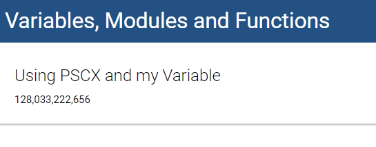
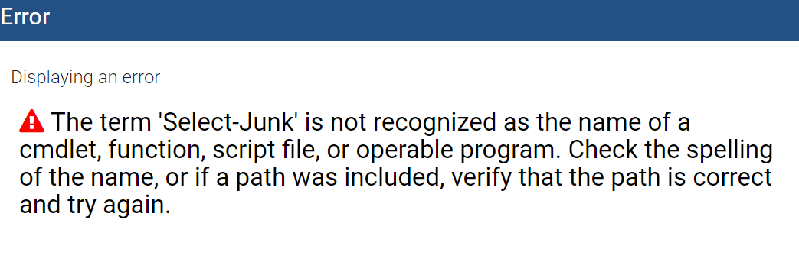

# Endpoints

Endpoints define the functionality that is executed with in the Universal Dashboard server. They can call any PowerShell script to retrieve data and send it to the client's web browser. Components that support server-side functionality will define an `Endpoint` parameter.

## Getting Started with Endpoints

Endpoints are simple PowerShell script blocks but do have some unique properties. The endpoints are executed within the Universal Dashboard service in a runspace pool that does not share the same execution environment as the runspace that started the dashboard.

This can be confusing to some users because variables and functions may not be available when working with endpoints.

Endpoints should return data in the manner that the component they are defined on expects. Many cmdlets, like `New-UDMonitor`, have a matching output cmdlet you should use, like `Out-UDMonitorData`, to return data from you endpoint.

```text
New-UDMonitor -Title "Downloads per second" -Type Line -Endpoint {
     Get-Random -Minimum 0 -Maximum 10 | Out-UDMonitorData
}
```

In the above example, the `Endpoint` parameter's script block is called whenever a user visits the website or the UDMonitor refreshes its data. Keep this in mind when defining script block functionality because long running endpoints can cause slow responses within your web site.

## Working with Variables, Functions and Modules

Universal Dashboard will attempt to copy variables from one scope to another when endpoints are defined. This means that global variables _may_ end up in the endpoint's runspace and be available for use. Some global variables, such as PowerCLI default server variables, do not behave well when copied in this manner.

To work around the limitations of this configuration `New-UDDashboard` exposes an `EndpointInitializationScript` parameter. This parameter should be used to define any PowerShell script that you would like to run once per runspace in the runspace pool. This would be a good place to import any modules, define any functions or variables that you want access to in any of your endpoints.

This script block may be called numerous times depending on the number of runspaces that are created in the pool and should be able to run like this without issue.

In the below example, I'm defining a variable and importing a module that I would like to use later in the script.

```text
$Dashboard = New-UDDashboard -Title "Variables, Modules and Functions" -Content {
    New-UDCounter -Title "Using PSCX and my Variable" -Endpoint {
        Get-DriveInfo | Where-Object Name -eq $TargetDrive | Select -Expand TotalSize
    }
} -EndpointInitializationScript {
    Import-Module Pscx
    $TargetDrive = "C:\"
}
Start-UDDashboard -Dashboard $Dashboard
```

Running the dashboard will yield the following result.



## Debugging Endpoints

Since Endpoints are just PowerShell scripts, there are bound to be issues. Terminating errors within endpoints will result in the dashboard displaying an error in the UI.



Sometimes this is enough information to successfully correct your script and move on. If you are still experiencing issues, please review the section on [debugging](../debugging.md).

