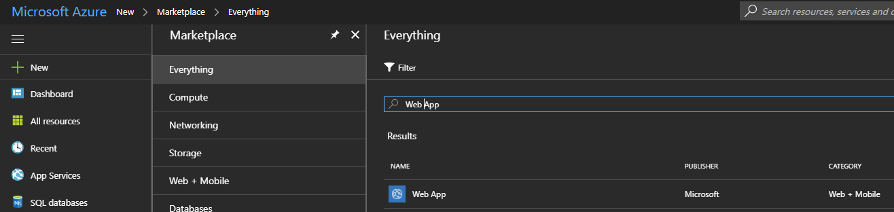
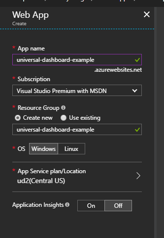
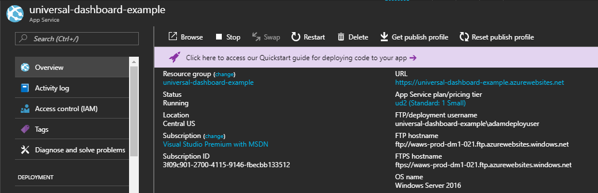
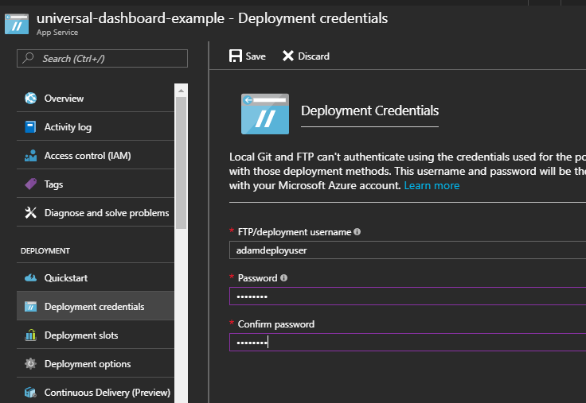
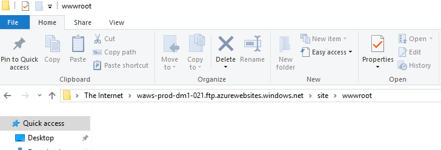
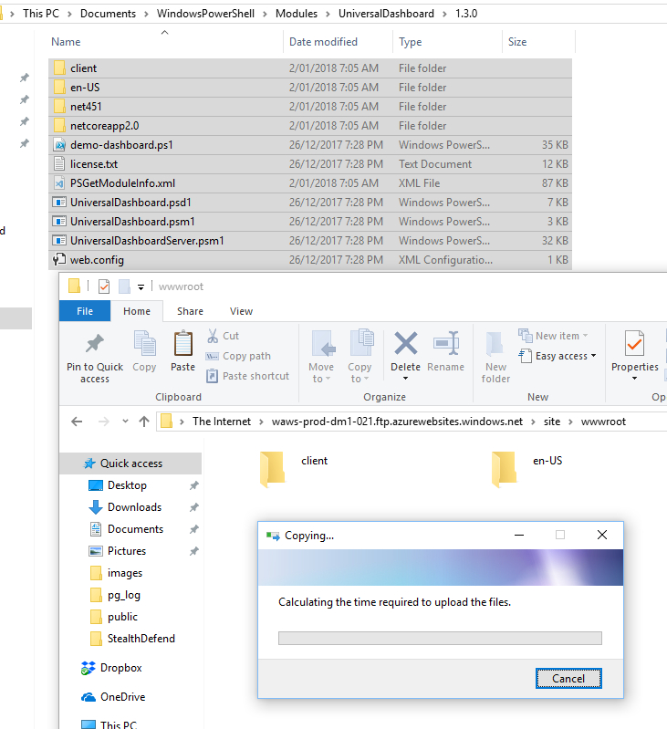
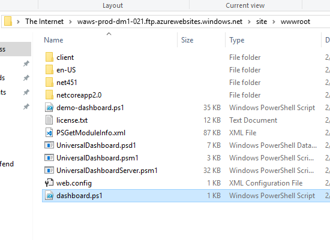
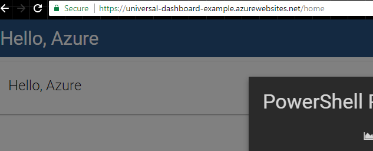

# Azure

To host a dashboard in Azure, you will need to deploy the entire module to your WebApp.

## Manually creating an Azure WebApp

First, create an Azure WebApp.

In the Azure Portal, click New, search for Web App and click Create.Enter your Web App's name, select the subscription and resource group.



Once provisioned, go to the WebApp's blade and retrieve the FTP hostname and username.

Next, define deployment credentials for the app.



Navigate to the wwwroot directory on the FTP server for your website.



Copy the entire contents of the PowerShell Universal Dashboard module to the wwwsite directory.



Create a `dashboard.ps1` file that contains `Start-UDDashboard` with the `-Wait` parameter.

```text
Start-UDDashboard -Wait -Dashboard (
    New-UDDashboard -Title "Hello, Azure" -Content {
        New-UDCard -Title "Hello, Azure"
    }
)
```

Copy the `dashboard.ps1` file to your `wwwsite` directory.



Now you should be able to navigate to your WebApp. When ever you need to update your dashboard, you can stop your WebApp and upload a new `dashboard.ps1`.



## Licensing

The license should be named license.lic and also placed in net472 directory. This will ensure that the license is persistent throughout restarts.

