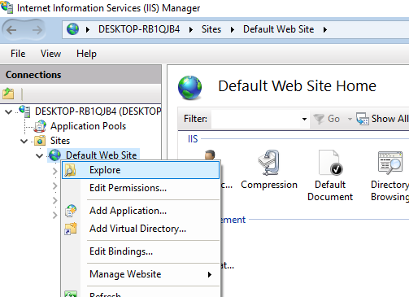
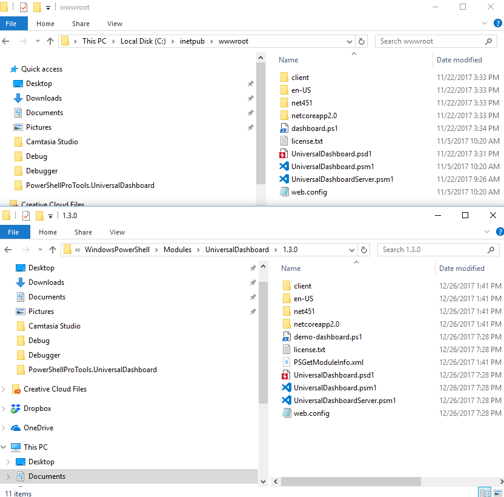
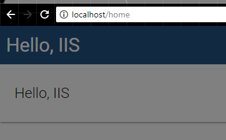

# IIS

To run a dashboard in IIS, you will need to configure an application pool and website just as you would with any other IIS web application. IIS requires that the [.NET Core Runtime and Hosting Bundle ](https://www.microsoft.com/net/download/thank-you/dotnet-runtime-2.1.5-windows-hosting-bundle-installer)is installed to run Universal Dashboard. Once installed, you will have to configure your website for Universal Dashboard.

Note: You will need to enable the WebSocket Protocol feature of IIS in order to use features of Universal Dashboard. Event handlers, such as OnClick, require this feature. The following cmdlets take advantage of WebSockets. 

* Add-UDElement
* Sync-UDElement
* Clear-UDElement
* Remove-UDElement
* Invoke-UDRedirect
* Show-UDModal
* Hide-UDModal
* AutoRefresh on Start-UDDashboard

## Configuring a site for Universal Dashboard

For this example we will look at the Default Web Site. In IIS Manager, right click on your Web Site and click Explore.



Copy the entire contents of the UniversalDashboard module to the wwwroot of the Default Web Site.



Create a `dashboard.ps1` file and place it in the `wwwroot` folder. The dashboard should contain a dashboard definition and a call to `Start-UDDashboard` with the `-Wait` parameter specified.

```text
 Start-UDDashboard -Wait -Dashboard (
    New-UDDashboard -Title "Hello, IIS" -Content {
        New-UDCard -Title "Hello, IIS"
    }
)
```

Navigate to the IIS website in your browser and you should see Universal Dashboard running.



## Creating Nested IIS Sites


Requires Universal Dashboard 2.3 or later


To create a nested IIS site, follow the same steps as above but nest your UD site beneath another site. You will have to make one change to the UD installation in this type of configuration. Within the UD folder, find the `index.html` file in the `client` folder. 

Within this file, change the `base` 's `href` attribute to match the relative URL of your UD installation. If you wanted to have the URL resolve to `http://myServer:8080/dashboards/dashboard`you would set the value of the `href` attribute to `/dashboards/dashboard/`.

For the URL of the two script files, you will need to remove the preceding `/` .

An example `index.html` looks like this. 

```text
<!DOCTYPE html>
<html>
<head>
    <base href="/dashboards/dashboard/"/>
    <meta charset="utf-8" />
    <meta name="viewport" content="width=device-width, initial-scale=1">
    <title>PowerShell Universal Dashboard</title>
<link rel="shortcut icon" href="favicon.ico"></head>
<body>
    <div id="app" class="app"/>
    <script type="text/javascript" src="main.9be8329c352d5b5e7801.bundle.js"></script><script type="text/javascript" src="vendor.9be8329c352d5b5e7801.bundle.js"></script></body>
</html>
```

## Licensing

The license should be named license.lic and placed in the `net472` folder within `wwwroot`. This will ensure that the license is persistent throughout restarts.

