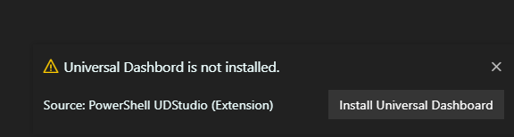
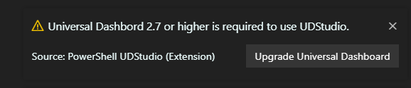
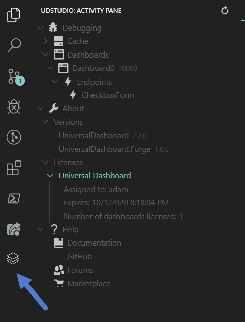
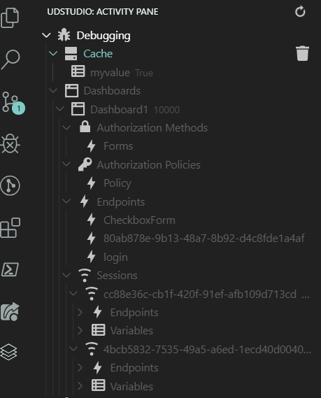
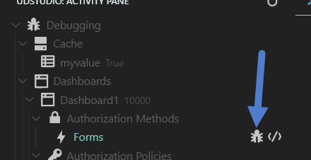
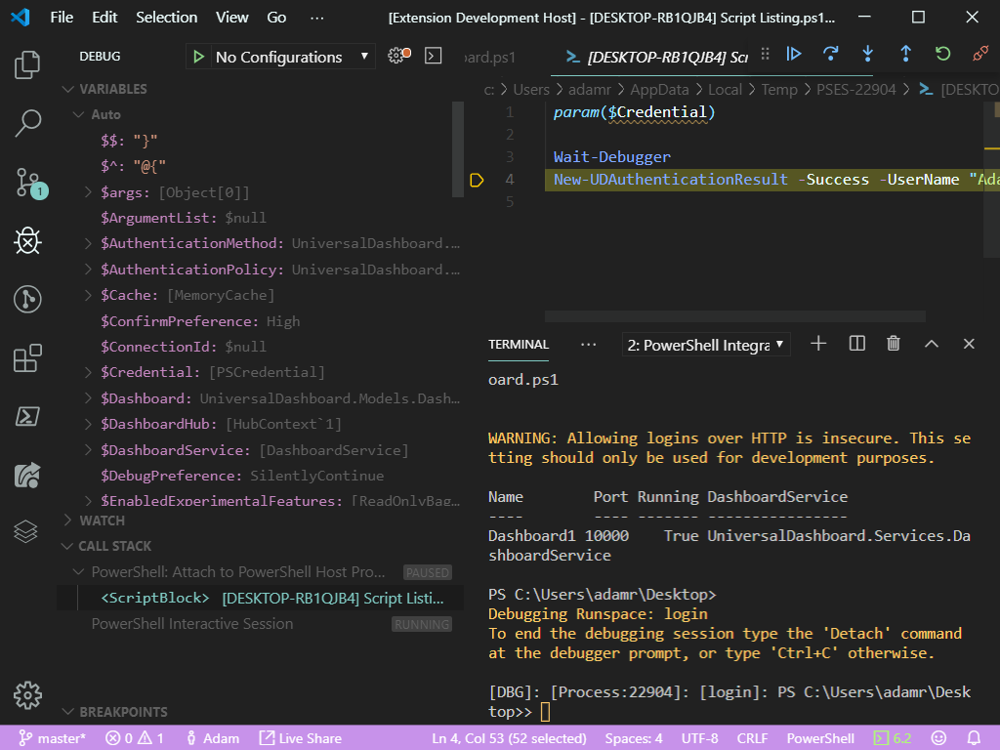
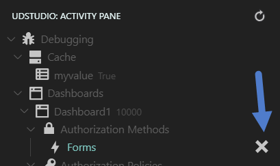
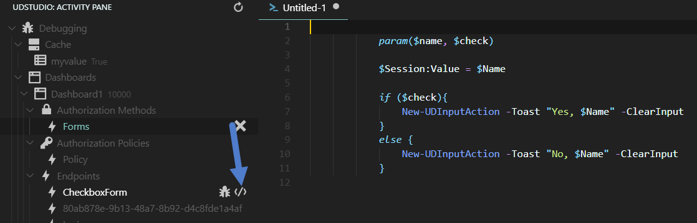
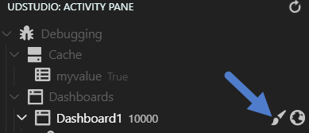

# UDStudio

UDStudio is a development environment for Universal Dashboard. It provides tools to make developing tools with Universal Dashboard easier. UDStudio ships as a [Visual Studio Code](https://code.visualstudio.com/) extension and requires a [Universal Dashboard Premium or Enterprise license](https://ironmansoftware.com/powershell-universal-dashboard/).

## Installation

You can install UDStudio from the extension pane in Visual Studio Code. Search for "PowerShell UDStudio" and install the extension. The extension requires that you have the PowerShell extension installed as well.

When starting up UDStudio, if you do not have Universal Dashboard installed, it will prompt to install the module from the PowerShell Gallery.

UDStudio requires Universal Dashboard 2.7 or later. If you are not running Universal Dashboard 2.7, it will prompt to upgrade. When new versions of Universal Dashboard are released, it will also notify you that they are avaialble and will give the option to upgrade.

## UDStudio Activity Pane

UDStudio provides an activity pane tree view with helpful tools for developing Universal Dashboard interfaces. The pane provides features such as debugging, module version information, license information and links to useful resources. Click the UD logo to view the UDStudio Activity Pane.

## View Dashboard Resources

When you start a dashboard in VS Code, UDStudio will automatically display information about the dashboard. This information includes dashboards, endpoints, sessions, authorization policies, authentication policies and cache varaibles.

## Debugging Endpoints

Using UDStudio, you can easily debug any type of endpoint in Universal Dashboard. This includes endpoints, session-based endpoints, REST API endpoints, scheduled endpoints, authorization policy endpoints and form-based authentication endpoints.

There is no need to add a Wait-Debugger call to your endpoint to make it work with UDStudio.

To set a new breakpoint, click the Set Breakpoint button the endpoint.

With the breakpoint set, you will need to then execute the endpoint. In this case, we would need to login to the dashboard. You may need to refresh the page, execute the REST API or wait for the scheduled endpoint to run. Once the endpoint is execute, VS Code will automatically break on the endpoint.

You'll have access to all the information about variables and will be able to step through your endpoint code.

The breakpoint will continue to be hit until you clear the breakpoint.

## Viewing Endpoint Code

You can view any endpoints code by clicking the View Code button for the endpoint.

## Toggling Admin Mode

You can toggle Admin Mode on and off without adjusting your dashboard script by clicking the Enable Admin Mode button on the dashboard node.

