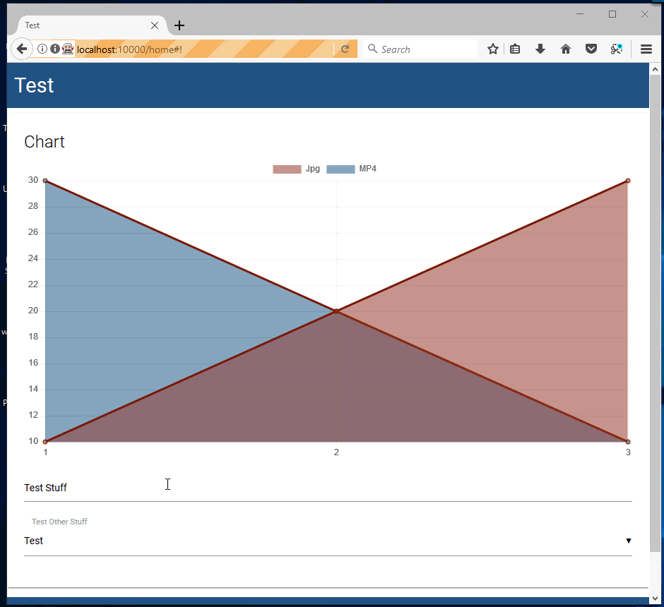

# v1.3.0

**Released: 12-26-2017**

### New Splash Screen

You can now start a dashboard server without specifying any parameters. The default dashboard links to help, licensing, an RSS feed of the PoshTools blog and lists popular dashboards on the PowerShell Gallery.

```text
Start-UDDashboard
```


### Update dashboards remotely

This version introduces a new function for updating dashboards remotely. You can now use Update-UDDashboard to send new dashboard content to a remote dashboard. When starting a dashboard, you can now specify an UpdateToken to serve as a password for updating content.

This means that you can deploy a simple script that just starts a dashboard server on a remote machine without having to deploy the entire dashboard script contents. You can then update it remotely at any time.

```text
Start-UDDashboard -Port 10000 -UpdateToken 1234
Update-UDDashboard -Url http://localhost:10000 -UpdateToken 1234 -Content {
     New-UDDashboard -Title "Updated" -Content {
        New-UDCard -Title "Update"
     }
}
```


### Collapsibles

Material Design collapsibles are accordion elements that expand when clicked on. They allow you to hide content that is not immediately relevant to the user. It will allow you to group charts, grids and other components into sections that users can expand and collapse.

```text
New-UDCollapsible -Id "Collapsible" -Items {
   New-UDCollapsibleItem -Title "First" -Icon user -Content {
      New-UDCard -Title "First"
   } -Active
   New-UDCollapsibleItem -Title "Second" -Icon group -Content {
      New-UDCard -Title "Second"
   }
   New-UDCollapsibleItem -Title "Third" -Icon user -Content {
      New-UDCard -Title "Third"
   }
}
```


### More Platform Support

Mac OSX, Ubuntu 17.10 and Windows 10 IoT ARM are now valid targets for Universal Dashboard. Anywhere you can run PowerShell v6.0.0-rc.2, you can run Universal Dashboard.

#### Inputs for charts \([\#181](https://github.com/adamdriscoll/poshprotools/issues/181)\)

Charts and monitors can now define filter fields to change the data show in the chart. You can use New-UDInputField and the FilterFields parameter of both New-UDChart and New-UDMonitor to define the input fields you would like to show. Next, just like New-UDInput, you can define parameters in the param block to accept the variables defined by the input fields.

```text
            New-UDChart -Title "Chart" -Id "Chart" -Type Line -EndPoint {
                param($Text, $Select) 

                $data = @(
                    [PSCustomObject]@{"Day" = 1; Jpg = "10"; MP4= "30"}
                    [PSCustomObject]@{"Day" = 2; Jpg = "20"; MP4= "20"}
                    [PSCustomObject]@{"Day" = 3; Jpg = "30"; MP4= "10"}
                )

                if ($Text -eq "Test") {
                    $data += [PSCustomObject]@{"Day" = 4; Jpg = "40"; MP4= "0"}
                }

                if ($Select -eq "Test2") {
                    $data += [PSCustomObject]@{"Day" = 5; Jpg = "50"; MP4= "100"}
                }

                $data | Out-UDChartData -LabelProperty "Day" -Dataset @(
                    New-UDChartDataset -DataProperty "Jpg" -Label "Jpg" -BackgroundColor "#80962F23" -HoverBackgroundColor "#80962F23"
                    New-UDChartDataset -DataProperty "MP4" -Label "MP4" -BackgroundColor "#8014558C" -HoverBackgroundColor "#8014558C"
                ) 
            } -FilterFields {
                New-UDInputField -Type "textbox" -Name "Text" -Placeholder 'Test Stuff'
                New-UDInputField -Type "select" -Name "Select" -Placeholder 'Test Other Stuff' -Values @("Test", "Test2", "Test3")
            }
```

Here's an example of the above chart. 

### Endpoint Debugging

Universal Dashboard creates a pool of runspaces to execute Endpoint script blocks. Even with the ability to debug runspaces in a process with Debug-Runspace, it's very difficult to identify the runspace that will end up running your endpoint because UD chooses which ever runspace is available. With v1.3.0, you can now use the -DebugEndpoint flag on components like charts, monitors and grids to ensure that the endpoint is run in the new "UDDebug" runspace.

This runspace is created only if the -DebugEndpoint is used and your Endpoint script block is being called. You can use Debug-Runspace to attach to the runspace and step through the code, inspect variables and identify errors.

Assume I have a dynamic column that calls the Endpoint script block below.

```text
            New-UDRow -Columns {
                New-UDColumn -Size 12 -Endpoint {
                    $MyVariable = Get-Random
                    $MyVariable2 = Get-Random

                    New-UDCard -Title $MyVariable -Text $MyVariable2
                } -DebugEndpoint
            }
```

I can now use Get-Runspace and Debug-Runspace to attach to the UDDebug runspace.

```text
PS C:\Users\adamr> Get-Runspace

 Id Name            ComputerName    Type          State         Availability
 -- ----            ------------    ----          -----         ------------
  1 Runspace1       localhost       Local         Opened        Busy
  2 UDDebug         localhost       Local         Opened        Available

PS C:\Users\adamr> Debug-Runspace -Name UDDebug
```

### Endpoint Initialization Script

New-UDDashboard and Start-UDRestApi now expose a EndpointInitializationScript parameter. This parameter is used to provide a script block that will be run when initializing any runspace that executes an Endpoint script block. You can import modules, define variables and even functions.

```text
        $dashboard = New-UDDashboard -Title "Test" -Content {
            New-UDRow -Columns {
                New-UDColumn -Size 12 -Endpoint {
                    New-UDCard -Title $TitleVariable -Text (Get-ContentForCard) -Id "Card" 
                }
                New-UDColumn -Size 12 -Endpoint {
                    New-UDCard -Title $TitleVariable -Text (Get-ContentForCard) -Id "Card2" 
                }
                New-UDColumn -Size 12 -Endpoint {
                    New-UDCard -Title $TitleVariable -Text (Get-ContentForCard) -Id "Card3" 
                }
            }
        } -EndpointInitializationScript {
            $TitleVariable = "Title"
            function Get-ContentForCard {
                "Body"
            }
        }
```

## Issues Resolved

* [\#230](https://github.com/adamdriscoll/poshprotools/issues/230) Disallow Starting of Dashboard when Login is used and server type is HTTP
* [\#227](https://github.com/adamdriscoll/poshprotools/issues/227) Issue with x64\x86 PowerShell Modules and native binaries
* [\#222](https://github.com/adamdriscoll/poshprotools/issues/222) \[New-UDGrid\] Grids show dates as "/Date\(...\)/"
* [\#221](https://github.com/adamdriscoll/poshprotools/issues/221) \[New-UDGrid\] Set page size
* [\#220](https://github.com/adamdriscoll/poshprotools/issues/220) UD does not work with OSX 
* [\#217](https://github.com/adamdriscoll/poshprotools/issues/217) Update Dashboards remotely 
* [\#215](https://github.com/adamdriscoll/poshprotools/issues/215) Support for Running on Windows 10 IoT - ARM 
* [\#214](https://github.com/adamdriscoll/poshprotools/issues/214) Overlap of input controls on Chart
* [\#176](https://github.com/adamdriscoll/poshprotools/issues/176) Frames for UD elements
* [\#138](https://github.com/adamdriscoll/poshprotools/issues/138) Exception while trying to start dashboard on Ubuntu 17.10
* [\#212](https://github.com/adamdriscoll/poshprotools/issues/212) v1.3.0-beta1 breaks all server side commands
* [\#211](https://github.com/adamdriscoll/poshprotools/issues/211) Unable to get property 'DateTime' of undefined or null reference
* [\#208](https://github.com/adamdriscoll/poshprotools/issues/208) Add TextAlignment and TextSize to New-UDCounter
* [\#203](https://github.com/adamdriscoll/poshprotools/issues/203) \[Feature Request\] Redirect to a specific URL after login.

