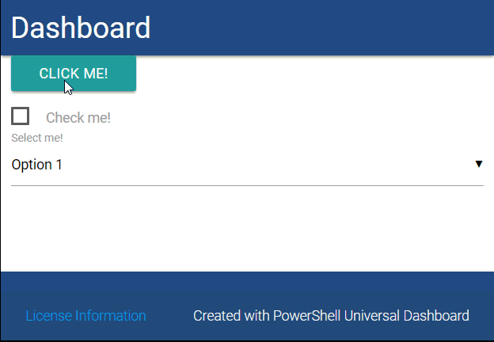
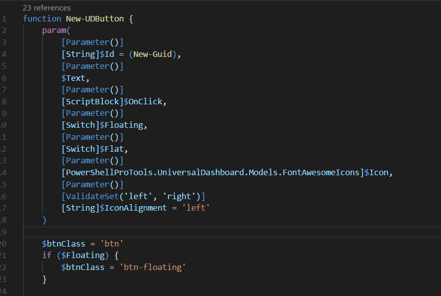
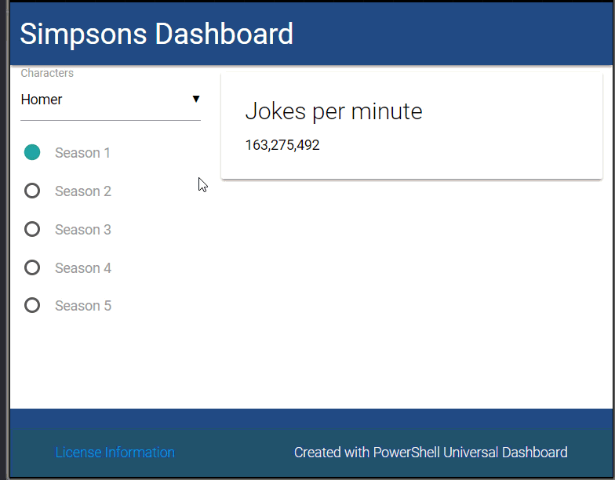
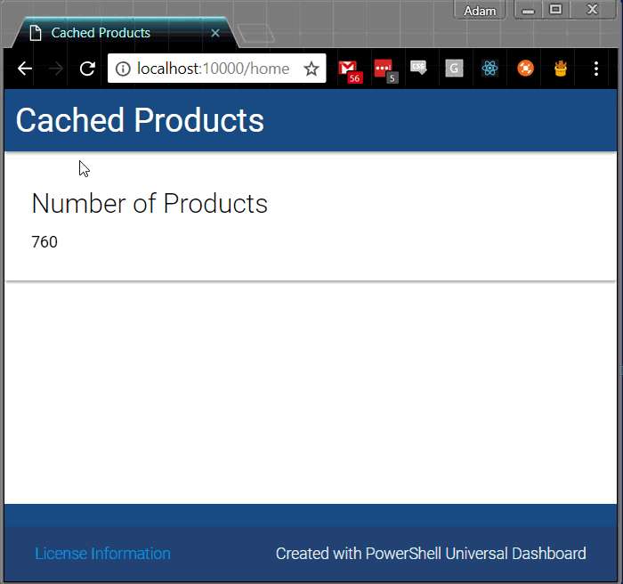
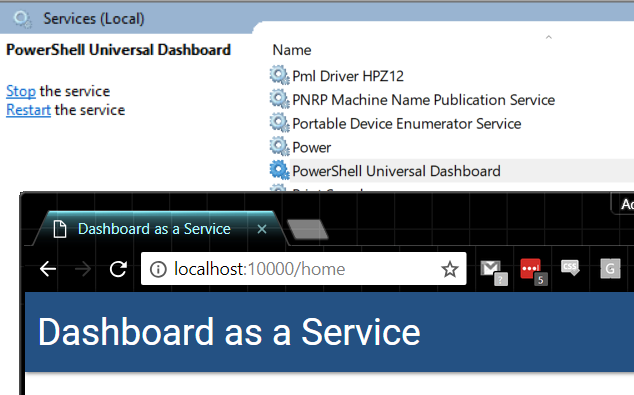
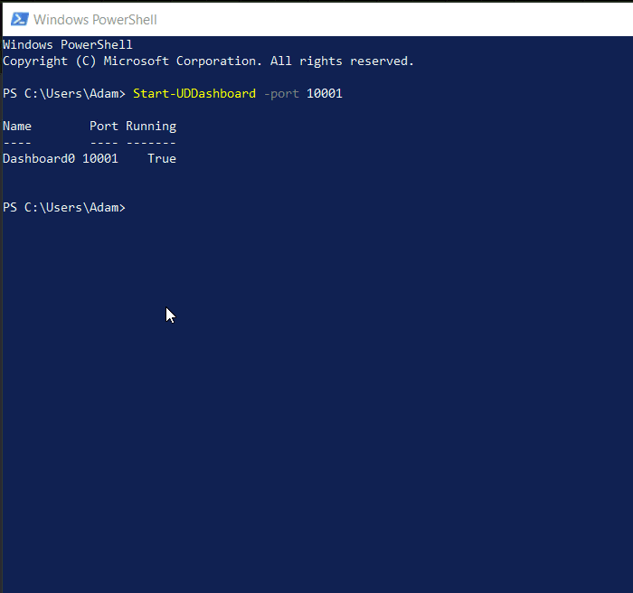

# v1.6.0

**Released: May 7th, 2018**

## 14 New Controls

From buttons to iframes; you can now create all kinds of controls. All these controls are built on New-UDElement and are open source. They expose all kinds of configuration options and events.

### Use buttons, textboxes and select drop downs to create customizable forms. Hook event handlers to take actions as users interact.



```text
New-UDButton -Text "Click me!" -OnClick {
    Send-UDToast -Message "Clicked!"
}
New-UDCheckbox -Label "Check me!" -OnChange {
    Send-UDToast -Message "Checked? $EventData"
}
New-UDSelect -Label "Select me!" -Option { 
    New-UDSelectOption -Name "Option 1" -Value 1
    New-UDSelectOption -Name "Option 2" -Value 2
    New-UDSelectOption -Name "Option 3" -Value 3
} -OnChange {
    Send-UDToast -Message "Selected $EventData"
}
```

### Organize components into collapsibles and collections.


```text
New-UDCollapsible -Items {
    New-UDCollapsibleItem -Icon bug -Title "Bug Report" -Content {
        New-UDHeading -Size 3 -Content {
            New-UDIcon -Icon exclamation -Color Green 
            "  No bugs!"
        } 
    }
    New-UDCollapsibleItem -Icon desktop -Title "Active Desktops" -Content {
        New-UDCollectionItem -Content { "mac-1234" } -SecondaryContent { New-UDIcon -Icon folder_open }
        New-UDCollectionItem -Content { "ubuntu-1234" } -SecondaryContent { New-UDIcon -Icon folder_open }
        New-UDCollectionItem -Content { "win10-1234" } -SecondaryContent { New-UDIcon -Icon folder_open }
        New-UDCollectionItem -Content { "centos-1234" } -SecondaryContent { New-UDIcon -Icon folder_open }
    }
    New-UDCollapsibleItem -Icon empire -Title "Support Cases" -Content {
        New-UDCollectionItem -Content { "New-UDHeading formats my computer." } -SecondaryContent { New-UDIcon -Icon globe }
        New-UDCollectionItem -Content { "Start-UDDashboard mines bitcoin." } -SecondaryContent { New-UDIcon -Icon globe }
    }
}
```

### Extend UD's control set by contributing to existing controls or developing your own. Visit the [ud-controls](https://github.com/ironmansoftware/ud-controls) GitHub repository for more information.



Some existing controls, such as cards, rows, columns and tables have been migrated to use New-UDElement rather than the previous C\# cmdlets.

## Session Variables

Session variables provide the ability to create rich user interfaces that rival PowerShell UIs built in Windows Forms and WPF. End response to user actions, like checking a checkbox or clicking a button, you can set session variables and update the state of other controls on the page.



```text
$Dashboard = New-UDDashboard -Title "Simpsons Dashboard" -Content {
    New-UDRow -Columns {
        New-UDColumn -Size 4 -Content {
            New-UDSelect -Label "Characters" -Option {
                New-UDSelectOption -Name "Homer" -Value "Homer"
                New-UDSelectOption -Name "Marge" -Value "Marge"
                New-UDSelectOption -Name "Bart" -Value "Bart"
                New-UDSelectOption -Name "Lisa" -Value "Lisa"
                New-UDSelectOption -Name "Maggie" -Value "Maggie"
            } -OnChange {
                $Session:Character = $EventData
                SEnd-UDToast -Message $EventData
                Sync-UDElement -Id "Counter"
            }

            New-UDRadio -Group "Season" -Label "Season 1" -OnChange { $Session:Season = 1; Sync-UDElement -Id "Counter" }
            New-UDRadio -Group "Season" -Label "Season 2" -OnChange { $Session:Season = 2; Sync-UDElement -Id "Counter" }
            New-UDRadio -Group "Season" -Label "Season 3" -OnChange { $Session:Season = 3; Sync-UDElement -Id "Counter" }
            New-UDRadio -Group "Season" -Label "Season 4" -OnChange { $Session:Season = 4; Sync-UDElement -Id "Counter" }
            New-UDRadio -Group "Season" -Label "Season 5" -OnChange { $Session:Season = 5; Sync-UDElement -Id "Counter" }
        }

        New-UDColumn -Size 8 -Content {
            New-UDCounter -Title "Jokes per minute" -Id "Counter" -Endpoint {
                if ($Session:Character -eq $null) {
                    0
                }
                else {
                    $Cache:SimpsonsData[$Session:Character][$Session:Season]
                }
            }
        }
    } 
}

$Cache:SimpsonsData = @{
    Homer = (0..5 | % {Get-Random})
    Marge = (0..5 | % {Get-Random})
    Bart = (0..5 | % {Get-Random})
    Lisa = (0..5 | % {Get-Random})
    Maggie = (0..5 | % {Get-Random})
}
```

Read more about Session variables on Gitbook.

## Cache Variables

Cache variables allow you to improve the performance of your dashboards by storing data across requests or with scheduled endpoints. Instead of querying data every time a control is loaded, you can now load data in the background and simply display the data from a cache variable. This will greatly improve user experience and alleviate the pressure on your resources that are being monitored.

## Scheduled Endpoints

Schedule endpoints are the task scheduler for Universal Dashboard. You can create scheduled endpoints with New-UDEndpoint that run on a simple second, minute or hour interval or you can get crazy an create custom CRON jobs.

Scheduled endpoints pair well with cache variables and databases to collect data and then display it in the UI.

For example, running `Get-WmiObject Win32_Product` takes about two minutes to run on my machine. No user is going to want to wait for that when looking at a dashboard!

Instead, use a scheduled endpoint and the cache to load the data in the background and serve it from the cache. It will only happen every 20 minutes and the page will load quickly.



```text
$Schedule = New-UDEndpointSchedule -Every 10 -Minute
$Endpoint = New-UDEndpoint -Schedule $Schedule -Endpoint {
    $Cache:Products = (Get-WmiObject Win32_Product).Count
}

$Dashboard = New-UDDashboard -Title "Cached Products" -Content {
    New-UDCounter -Title "Number of Products" -Endpoint {
        $Cache:Products
    }
}

Start-UDDashboard -Dashboard $Dashboard -Port 10000 -Endpoint $Endpoint
```

## Universal Dashboard as a Windows Service

Universal Dashboard can now be run as a Windows Service. Using Publish-UDDashboard, you can create a Windows service to host your dashboard and avoid using IIS.



## Improved Performance

Through some adjustments to the execution service within Universal Dashboard, the performance of endpoint execution has been increased by two to four times; based on your hardware.

## Integrated Examples

You can use `Start-UDDashboard` without a dashboard specified to see examples of all the controls that UD offers.



## Grab the latest and provide feedback!

Grab the latest Universal Dashboard module from the PowerShell Gallery. Feel free to provide feedback on [GitHub](https://github.com/ironmansoftware/universal-dashboard/issues).

