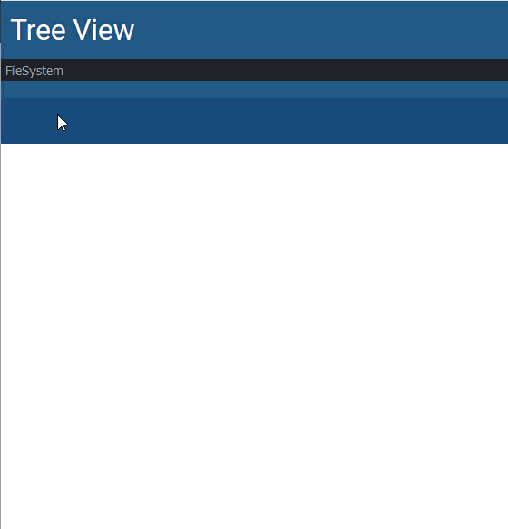

# v2.0.0

## v2.0.0

* [Universal Dashboard](https://www.powershellgallery.com/packages/UniversalDashboard/2.0.0)
* [Universal Dashboard Community Edition](https://www.powershellgallery.com/packages/UniversalDashboard.Community/2.0.0)

**Released: August 31st, 2018**

## New Features

### Community Edition

Universal Dashboard Community Edition is now available on the Gallery. This free and open-source version of Universal Dashboard has no time limits and can be used to create beautiful websites and REST APIs without paying a licensing cost.

```text
Install-Module UniversalDashboard.Community
```

### Enterprise Edition

Universal Dashboard Enterprise Edition builds on top of what's available in Community Edition but extends the platform to enable authentication, authorization and branding support.

```text
Install-Module UniversalDashboard
```

### Tree View

A tree view control has been added to allow you to expose and navigate tree structures in UD. You can hook into PSProviders and handle click events to display data.



An example of the tree view can be found within the [UD repository](https://github.com/ironmansoftware/universal-dashboard/blob/master/examples/tree-view/filesystem.ps1).

### Floating Action Button

A floating action button is a button pinned to the bottom right of the page. It allows you to put some simple, easy to access controls on your dashboard. They support nested buttons and onClick event handlers.

Thanks, [BryanDM](https://github.com/BryanDM)!!


### More Customizable Toasts

In previous versions of UD, you could send toast messages view Send-UDToast. In 2.0, you can now create extremely customized toast messages that allow you to configure colors, text size, icons and timing. Using Show-UDToast and Hide-UDToast you have total control over the toast messages.


### Publish Folders

There was no good way to serve any old file in previous versions of Universal Dashboard. The newly added Publish-UDFolder cmdlet enables just that. You can now publish any folder you'd like and assign a URL to it.

```text
Start-UDRestApi -Port 10001 -PublishedFolder @(
    Publish-UDFolder -Path $TempPath -RequestPath "/temp"
)
Invoke-WebRequest http://localhost:10001/temp/myFile.txt
```

### Improved Endpoint Initialization

Up until this version of you would use the EndpointInitializationScript to setup the endpoints for UD components. The ScriptBlock was converted into a string and wasn't a good way to actually initialize the endpoints. It made it difficult to import modules, load function and variables into endpoints.

With 2.0, you can now use the New-UDEndpointInitialization cmdlet to create an InitialSessionState object. This object is used to initialize all the runspaces used within UD. This is a standard PowerShell object and can be used to add modules, variables and functions to the runspaces.

```text
 $Initialization = New-UDEndpointInitialization -Module MyModule -Variable "MyVariable" -Function 'Get-Stuff'

$dashboard = New-UDDashboard -Title "Test" -Content {
    New-UDCounter -Title "Counter" -Id "Counter" -Endpoint {
        # Function exported from MyModule
        Get-Number 
    }

    New-UDElement -tag "div" -Id "variable" -Content {
        $MyVariable
    }

    New-UDElement -tag "div" -Id "function" -Content {
        Get-Stuff
    }
} -EndpointInitialization $Initialization
```

### Improved Endpoint Arguments

In previous versions of Universal Dashboard, variables were "automatically" added to Endpoints based on the local scope. This meant that you didn't really have to do anything to get variables into an endpoint. It didn't work very well all the time. :\( Although this automatic import is still happening, you now have more control over endpoints. You can now use `New-UDEndpoint` and a handy new `-ArgumentList` parameter to pass in values to your endpoints.

This will work for event handlers as well as controls with Endpoint callbacks.

```text
$Name = "calc"
New-UDButton -Text 'Start Calc' -Id 'button' -OnClick (
    New-UDEndpoint -Endpoint { Start-Process $ArgumentList[0] } -ArgumentList $Name
)
```

### Role-Based Access \(Enterprise Only\)

Universal Dashboard has offered authentication for a few versions now via login pages and JSON Web Tokens. In this version we are now introducing authorization. The first type of authorization that you can utilize is role-based access. You can assigning roles to pages and REST API endpoints to allow only certain roles access to those pages or endpoints. Pages that aren't accessible won't even show up in the navigation menu.

When a user logs in, you can assign roles to that user. In the below example, Adam is assigned the Admin role on login. The Home and Settings pages allow Admins to access them while only Users cannot access the Settings page.

```text
$AuthenticationMethod = New-UDAuthenticationMethod -Endpoint {
    param([PSCredential]$Credential)

    elseif ($Credential.UserName -eq "Adam") {
        New-UDAuthenticationResult -UserName "Adam" -Success -Role "Admin"
    } else {
        New-UDAuthenticationResult -ErrorMessage "You're not Adam!!"
    }
}

$LoginPage = New-UDLoginPage -AuthenticationMethod $AuthenticationMethod

$dashboard = New-UDDashboard -Title "Test" -LoginPage $LoginPage -Pages @(
    New-UDPage -Name "Home" -Content {
        New-UDHeading -Text "Home" -Id "Home"
    } -AuthorizedRole @("User", "Admin")

    New-UDPage -Name "Settings" -Content {
        New-UDHeading -Text "Settings" -Id "Settings"

        New-UDElement -Tag "div" -Id "myEndpoint" -Endpoint {
            "Test"
        }
    } -AuthorizedRole "Admin"
)
```

### Policy-Based Authorization \(Enterprise Only\)

In addition to role-based authorization, you can also use policy-based authorization. Policy authorization allows you to evaluate a user's claims and decide whether the user has access to a particualr page or endpoint.

Policy-based authorization works well for 3rd party authentication mechanisms. You can check claims provided by services such as Azure Active Directory. This means you don't need to update a dashboard to change the access of users to the dashboard.

In the below example, the policy is checks to see if the user has a groups claim with a value of administrators. If they as part of this group, they have access to the setting page.

```text
$AuthorizationPolicy = New-UDAuthorizationPolicy -Name "Policy" -Endpoint {
    param($User)

    $User.HasClaim("groups", "administrators")
}

$LoginPage = New-UDLoginPage -AuthenticationMethod $AuthenticationMethod -AuthorizationPolicy @($AuthorizationPolicy)

$dashboard = New-UDDashboard -Title "Test" -LoginPage $LoginPage -Pages @(
    New-UDPage -Name "Home" -Content {
        New-UDHeading -Text "Home" -Id "Home"
    } 

    New-UDPage -Name "Settings" -Content {
        New-UDHeading -Text "Settings" -Id "Settings"

        New-UDElement -Tag "div" -Id "myEndpoint" -Endpoint {
            "Test"
        }
    } -AuthorizationPolicy "Policy"
)
```

### Azure Active Directory Authentication \(Enterprise Only\)

New-UDAuthenticationMechanism now supports configuring Azure Active Directory Authentication. Paired with policy-based authentication, you can assign users to groups that have access to particular pages and endpoints within Universal Dashboard.

## Breaking Changes

### System Requirements

UD has been upgraded to use ASP.NET 2.1. Because of this the following system requirements are necessary for UD 2.0.

#### Window PowerShell

* PowerShell v5.1
* .NET 4.7.1

#### PowerShell Core

* PowerShell Core v6.1

### DebugEndpoint Parameter Removed

The `-DebugEndpoint` parameter has been removed. Guidance is to use Wait-Debugger within Endpoints for debugging.

### EndpointInitializationScript Parameter Removed

The `-EndpointInitializationScript` parameter has been removed from New-UDDashboard cmdlet. It is suggested to use the New-UDEndpointInitialization cmdlet instead.

### DateTimeFormat Parameter of New-UDTable

The `-DateTimeFormat` parameter has been moved from New-UDTable to Out-UDTableData.

### Send-UDToast renamed to Show-UDToast

With the addition of Hide-UDToast, it made sense to rename Send-UDToast to Show-UDToast.

### Issues Resolved

* [\#321](https://github.com/ironmansoftware/universal-dashboard/issues/321) - New-UDChartLegendOptions generates nothing Or wrong Output \(Thanks, [PSTobiasMueller](https://github.com/PSTobiasMueller)!\)
* [\#315](https://github.com/ironmansoftware/universal-dashboard/issues/315) - Custom Component JavaScript Element ud-sparklines not working
* [\#312](https://github.com/ironmansoftware/universal-dashboard/issues/312) - Remove EndpointInitializationScript and introduce EndpointInitialization property\cmdlet
* [\#310](https://github.com/ironmansoftware/universal-dashboard/issues/310) - UDTheme not Applied to New-UDCard
* [\#309](https://github.com/ironmansoftware/universal-dashboard/issues/309) - Move DateTimeFormat from New-UDTable to Out-UDTableData
* [\#308](https://github.com/ironmansoftware/universal-dashboard/issues/308) - Role-based access
* [\#306](https://github.com/ironmansoftware/universal-dashboard/issues/306) - Flex box issue
* [\#303](https://github.com/ironmansoftware/universal-dashboard/issues/303) - New-UDCard - Image Card doesn't display Image \(Thanks, [PSTobiasMueller](https://github.com/PSTobiasMueller)!\)
* [\#301](https://github.com/ironmansoftware/universal-dashboard/issues/301) - IE 11 - Object doesn't support property or method 'from' when using selectable inputs
* [\#295](https://github.com/ironmansoftware/universal-dashboard/issues/295) - License not working for 2.0.0 beta2
* [\#289](https://github.com/ironmansoftware/universal-dashboard/issues/289) - Please add -Endpoint to New-UDCard Thanks.
* [\#287](https://github.com/ironmansoftware/universal-dashboard/issues/287) - New-UDDashboard -NavBarLogo
* [\#286](https://github.com/ironmansoftware/universal-dashboard/issues/286) - Add Icon to UD Module for the Gallery!
* [\#277](https://github.com/ironmansoftware/universal-dashboard/issues/277) - dynamic page with cycle pages
* [\#274](https://github.com/ironmansoftware/universal-dashboard/issues/274) - Tree view component for files and folder
* [\#272](https://github.com/ironmansoftware/universal-dashboard/issues/272) - Hide-UDToast
* [\#271](https://github.com/ironmansoftware/universal-dashboard/issues/271) - Rename Send-UDToast to Show-UDToast
* [\#268](https://github.com/ironmansoftware/universal-dashboard/issues/268) - Floating Action Button \(Thanks, [BryanDM](https://github.com/BryanDM)!\)
* [\#266](https://github.com/ironmansoftware/universal-dashboard/issues/266) - Remove DebugEndpoint parameters
* [\#265](https://github.com/ironmansoftware/universal-dashboard/issues/265) - Microsoft Edge - Object doesn't support property or method 'updateTextFields'
* [\#244](https://github.com/ironmansoftware/universal-dashboard/issues/244) - Dynamic page causes autocycle feature to halt
* [\#239](https://github.com/ironmansoftware/universal-dashboard/issues/239) - Commands in Buttons
* [\#223](https://github.com/ironmansoftware/universal-dashboard/issues/223) - Endpoint script block persisting variables accross multiple calls of New-UDInput
* [\#209](https://github.com/ironmansoftware/universal-dashboard/issues/209) - New-UDTable cannot use properties of classes as content
* [\#208](https://github.com/ironmansoftware/universal-dashboard/issues/208) - Authentication cannot be restricted since $User & $ClaimsPrinciple $Null
* [\#204](https://github.com/ironmansoftware/universal-dashboard/issues/204) - Microsoft Org endpoint \(enhancement\) and/or custom oauth endpoints.
* [\#196](https://github.com/ironmansoftware/universal-dashboard/issues/196) - Migrate to .NET Core\ASP.NET Core 2.1
* [\#183](https://github.com/ironmansoftware/universal-dashboard/issues/183) - Ability to remove toast notification?
* [\#114](https://github.com/ironmansoftware/universal-dashboard/issues/114) - New-UDCard -Icon
* [\#107](https://github.com/ironmansoftware/universal-dashboard/issues/107) - Allow user to download file from server
* [\#77](https://github.com/ironmansoftware/universal-dashboard/issues/77) - Provide different toast savors

