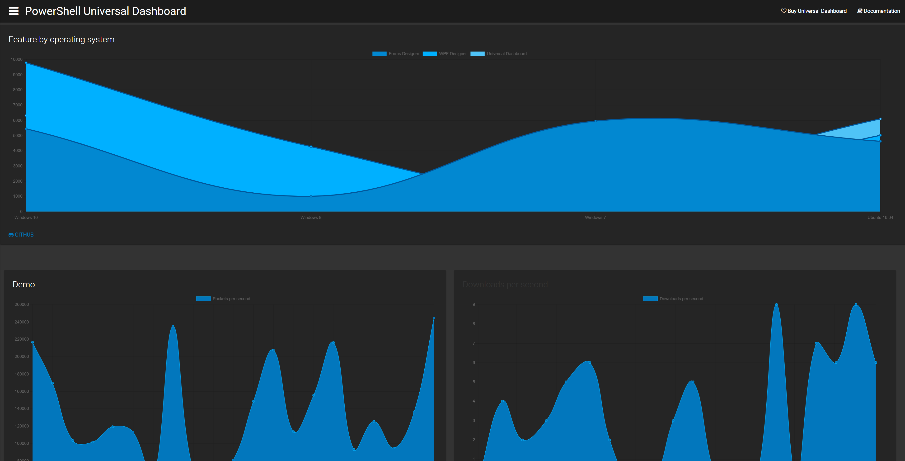

# v2.1.0

## Support for Icons8 line-awesome font icons

Thanks, [Alon Gvili](https://github.com/AlonGvili)!

You can now select the [line-awesome ](https://icons8.com/line-awesome)font icon set by setting the `-FontIconStyle` parameter of `New-UDDashboard` to `LineAwesome`

## New Image Carousel Control

Thanks, [Alon Gvili](https://github.com/AlonGvili)!

You can now create image carousels using `New-UDImageCarousel` and `New-UDImageCarouselItem` .

## Default File Types for Publish-UDFolder

Thanks, [Alon Gvili](https://github.com/AlonGvili)!

`Publish-UDFolder` now automatically has file type mappings for ps1, psm1, psd1, log, yml as well as the built in known file types.

## Width and Height Parameters for New-UDChart and New-UDMonitor

Thanks, [Alon Gvili](https://github.com/AlonGvili)!

You can now set Height and Width parameters of `New-UDChart` and `New-UDMonitor`.

## Login Button Colors

You can now set the color of the login button using the `-LoginButtonFontColor` and `-LoginButtonBackgroundColor` parameters of `New-UDLogin`

## Bug Fixes

* [EndpointInitialization -Module Requires Full Path](https://github.com/ironmansoftware/universal-dashboard/issues/326)
* [New-UDFooter -Links doesn't do anything](https://github.com/ironmansoftware/universal-dashboard/issues/362)
* [Checkbox onChange does not work](https://github.com/ironmansoftware/universal-dashboard/issues/429)
* [UDSelect onChange Not Working \(Browser Error\)](https://github.com/ironmansoftware/universal-dashboard/issues/338)
* [New-UDEndpointInitialization doesnt load module](https://github.com/ironmansoftware/universal-dashboard/issues/366)
* [IE 11 not refreshing charts](https://github.com/ironmansoftware/universal-dashboard/issues/395)
* [Only with IE11 Error 404](https://github.com/ironmansoftware/universal-dashboard/issues/374)
* [New-UDAuthenticationResult has a default value for ErrorMessage contrary to help](https://github.com/ironmansoftware/universal-dashboard/issues/371)
* [Publish-UDDashboard uses wrong path in 2.0](https://github.com/ironmansoftware/universal-dashboard/issues/346)
* [New-UDInputField date parameter](https://github.com/ironmansoftware/universal-dashboard/issues/388) \(Thanks, [Alon Gvili](https://github.com/AlonGvili)!\)
* [New-UDCard Text Doesn't Display](https://github.com/ironmansoftware/universal-dashboard/issues/383) \(Thanks, [Alon Gvili](https://github.com/AlonGvili)!\)
* [Fix for -Path parameter in New-UDImage](https://github.com/ironmansoftware/universal-dashboard/pull/373) \(Thanks, [Mike Campbell](https://github.com/exactmike)!\)
* [New Udimage fix](https://github.com/ironmansoftware/universal-dashboard/pull/323) \(Thanks, [Tobias](https://github.com/PSTobiasMueller)!\)

