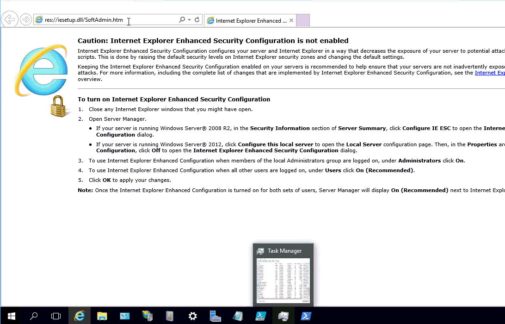

# v2.2.0

## Links

* [Universal Dashboard Community](https://www.powershellgallery.com/packages/UniversalDashboard.Community/2.2.0)
* [Universal Dashboard](https://www.powershellgallery.com/packages/UniversalDashboard/2.2.0)

## UDInput validation

You can now use ValidationAttribute's to validate UDInput's on the client. Once a user enters something into a text field, the validation logic will run and provide the user with an error message directly in the browser.


You can customize the error message using the `UniversalDashboard.ValidationErrorMessage` attribute or by using `ValidationScript` .

For examples of how to use this feature, check out the integration tests: [https://github.com/ironmansoftware/universal-dashboard/blob/master/src/UniversalDashboard.UITest/Integration/Input.Tests.ps1\#L46](https://github.com/ironmansoftware/universal-dashboard/blob/master/src/UniversalDashboard.UITest/Integration/Input.Tests.ps1#L46)

## New Enterprise Charts


Nivo charts are not available in Community Edition


Universal Dashboard 2.2.0-beta2 adds support for [Nivo](http://nivo.rocks/) charts. This chart library is built on React and D3 to provide highly configurable and beautiful data visualizations . In addition to the standard charts, such as bar and line charts, there are also new chart types such as calendar and treemap.

You can access all the charts with a single cmdlet: `New-UDNivoChart`. This cmdlet exposes an extensive amount of configurable parameters for your charts.

### New Color Options

Nivo charts provides 50 built in color palettes to use with your charts. You can set the `-Colors` parameter on your chart to set your color palette. Additionally, you can provide color data directly with the data in your chart rather than having to provide a separate array of colors.

For more information on colors, visit the [Nivo color documentation](http://nivo.rocks/guides/colors).


### Fill Patterns

In addition to custom colors, you can also define fill patterns for your chart components. You can define lines or dots and choose the corresponding colors.

```text
$Pattern = New-UDNivoPattern -Dots -Id 'dots' -Background "inherit" -Color "#38bcb2" -Size 4 -Paddin 1 -Stagger
$Fill = New-UDNivoFill -ElementId "hot dog" -PatternId 'dots'
```


### Interactive Charts

Nivo charts support `-onClick` event handlers. You can provide a script block and when the chart is clicked, it will be invoked with the `$EventData` variable populated with the JSON representation of the data that was clicked within the chart.

```text
-OnClick {
    Show-UDToast -Message $EventData -Duration 3000
}
```


### Differences between `New-UDChart`

### No Auto Refresh

The Nivo chart cmdlet doesn't expose an `-Endpoint` or `-AutoRefresh` parameter directly. That said, it's still possible to auto refresh by putting the chart within a a layout element, like a column, with autorefresh settings enabled and setting the `-Id` of the chart to anything.

```text
 New-UDColumn -SmallSize 6 -AutoRefresh -RefreshInterval 5 -Endpoint {
    New-UDHeading -Text "Line" -Size 4
    New-UDHeading -Text "A standard line chart."

    New-UDNivoChart  -Id 'lineChart' -Line -Data $Cache:Data -Height 400 -Width 600 -MarginBottom 50 -MarginTop 50 -MarginRight 110 -MarginLeft 60 -OnClick {
        Show-UDToast -Message $EventData -Duration 3000
    }

}
```


### No Out-UDChartData

Data can be provided to the charts directly through the `-Data` parameter rather than having to be piped through a cmdlet like `Out-UDChartData`. The reason for this is that each type of chart expects different types of data structures.

Click the [data tab](http://nivo.rocks/bar) for an example of what each chart's data structure should look like. You can define a hashtable that matches the structure of the JSON and it will be automatically serialized for your.

## Interactive New-UDChart

You can now specify an `-OnClick` event handler for `New-UDChart`. When the chart is clicked, your script block will receive an `$EventData` variable with the JSON for the data point that was clicked.

## IIS SSO Window Authentication


Not available in Community Edition


You can now configure UD to take advantage of IIS Windows Authentication to provide Single-Sign On experiences. This works for both a dashboard and a REST API. When accessing the dashboard, you won't be shown the login page and will go directly to the dashboard.

```text
$Endpoint = New-UDEndpoint -Url 'test' -Endpoint {
    'Hi'
}

Start-UDDashboard -Content {
   $Auth = New-UDAuthenticationMethod -Windows
    $LoginPage = New-UDLoginPage -AuthenticationMethod @( $Auth) -PassThru

    New-UDDashboard -Title "Line" -Content { 
        New-UDRow -Columns {
            New-UDColumn -Size 12 -Endpoint  {
                New-UDHeading -Text "Logged in as $user"
            }
        }
    } -LoginPage $LoginPage 
} -Wait -AllowHttpForLogin -Endpoint $Endpoint
```



## Design Terminal

You can now interact with the UD runspaces with a built in terminal. You can call cmdlets like `Add-UDElement` to add elements to the live dashboard. These changes aren't saved anywhere but allows you to play around with the features.


## Client Side Code Splitting

The 2.1 UD JavaScript package reached over 2.5 MBs! Thanks to, [Alon Gvili](https://github.com/AlonGvili), the package is now split into smaller bits. Each component now resides in it's own JS file. They load automatically and won't load if you aren't using them. The main JS file is now down below 700kb. This will ensure that first time loads are much quicker.


## Other Features

* [Configurable session timeout](https://github.com/ironmansoftware/universal-dashboard/issues/473)
* [Log levels for log entries](https://github.com/ironmansoftware/universal-dashboard/issues/481)
* [Change title of login page \(Enterprise\)](https://github.com/ironmansoftware/universal-dashboard/issues/454)
* [Event logging for Publish-UDDashboard](https://github.com/ironmansoftware/universal-dashboard/issues/438) 

## Resolved Issues

For a full list of closed issues, please visit the [2.2.0 milestone on GitHub](https://github.com/ironmansoftware/universal-dashboard/milestone/12?closed=1).

